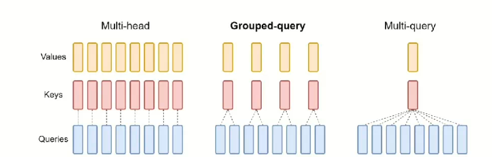

## 1.什么是GQA

  分组查询注意力，就是Query的部分进行分组，每个组共享一组KV，GQA吧查询头分成G组，每个组内部的头部共享一个相同的K和V的组合。



## 2.llama中的GQA实现

```python
model_parallel_size = fs_init.get_model_parallel_world_size()
self.n_local_heads = args.n_heads // model_parallel_size
self.n_local_kv_heads = self.n_kv_heads // model_parallel_size
self.n_rep = self.n_local_heads // self.n_local_kv_heads
self.head_dim = args.dim // args.n_heads
```

 ` n_rep 就是我们的GQA的核心参数了，每个KV头要重复多少次以应对KV头

```python
keys = repeat_kv(keys, self.n_rep)  # (bs, cache_len + seqlen, n_local_heads, head_dim)
values = repeat_kv(values, self.n_rep)  # (bs, cache_len + seqlen, n_local_heads, head_dim)
```

  底层我们可以直接浅拷贝，节省我们的模型开销。

## 3.总结

  再打模型计算中，Q的头数一般多以我们的KV头数，为了保证多Q头的同时，尽可能的节省KV显存，我们需要多个Q头共享同一组KV头。核心的视线，在我们的`repert_KV`进行浅拷贝就行了。 
