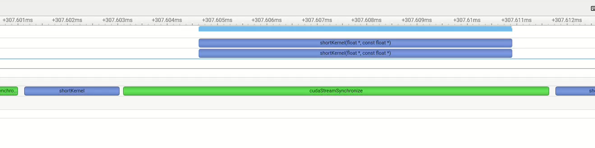
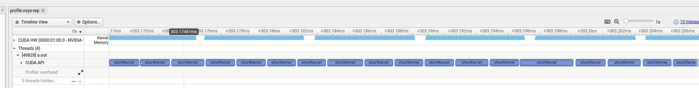
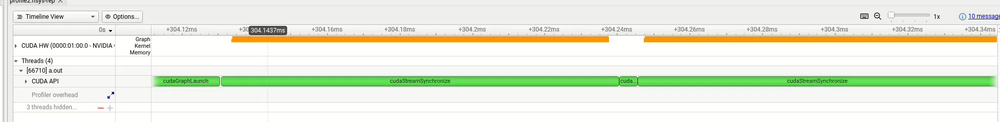

## 1.背景

GPU的操作或者内存拷贝现已经被缩短为微秒级别，GPU的内核提交操作同样被缩短为微秒级别。实际应用通常会执行大量的 GPU 操作：一个典型的模式是包含许多迭代（或时间步），每个时间步中又包含多个操作，每个时间步需要执行不同算法阶段的GPU操作，这些操作被单独提交到GPU上执行，且每个操作很快完成，那么整体的性能就会下降，提交开销就会积累。

### 1.1EXAMPLE

```c++
#define N 500000 // tuned such that kernel takes a few microseconds

__global__ void shortKernel(float * out_d, float * in_d){
  int idx=blockIdx.x*blockDim.x+threadIdx.x;
  if(idx<N) out_d[idx]=1.23*in_d[idx];
}
```

- 每个时间步都有一个很短的内核操作

```c++
#define NSTEP 1000
#define NKERNEL 20
for(int istep=0; istep<NSTEP; istep++){
  for(int ikrnl=0; ikrnl<NKERNEL; ikrnl++){
    shortKernel<<<blocks, threads, 0, stream>>>(out_d, in_d);
    cudaStreamSynchronize(stream);
  }
}
```

### 1.2CUDA GRAPH

CUDA_Graph的设计初衷就是为了解决这个问题，将工作定义为图而非单个操作，可以通过一次CPU调用同时启动多个GPU操作，从而减小开销。



从此处可以看出，启动内核占比开销相当之高



这里依然把同步的操作取消了，本身就是异步排队的，所以不需要额外的同步开销：CPU 需要查询 GPU 的任务状态，可能通过 PCIe 总线或轮询完成标志，但是我们还是可以看到，内核依然在断断续续的执行。这里就是不停的启动内核带来的开销了。

同时，这里程序加速的本质原因是：Kernel的发起与执行时间重叠，核函数的启动和运行可以同时执行了。

## 2.基于 CUDA Graph 的优化实现

使用cuda Graph 在每次迭代中一次性启动所有的 Kernel 来进一步提升性能

```c++
bool graphCreated=false;
//定义图的结构和内容
cudaGraph_t graph;
//可执行图的实例
cudaGraphExec_t instance;
for(int istep=0; istep<NSTEP; istep++)
{
  
  if(!graphCreated)
  {
    //捕捉在 begin 和 end 之间提交到stream 的GPU的活动信息
    cudaStreamBeginCapture(stream, cudaStreamCaptureModeGlobal);
    for(int ikrnl=0; ikrnl<NKERNEL; ikrnl++)
    {
      shortKernel<<<blocks, threads, 0, stream>>>(out_d, in_d);
    }
    cudaStreamEndCapture(stream, &graph);
    cudaGraphInstantiate(&instance, graph, NULL, NULL, 0);
    graphCreated=true;
  }
  cudaGraphLaunch(instance, stream);
  cudaStreamSynchronize(stream);
}
```

这里的图只需要在第一次时间步捕捉和实例化一次，随后可以重复使用同一个实例进行所有后续时间步的执行操作。但是在初始化的开销十分的严重，如果想要从图中获益，那么就需要足够多次重复启动同一个图。



目前的效率和cudaGraph差不多。


