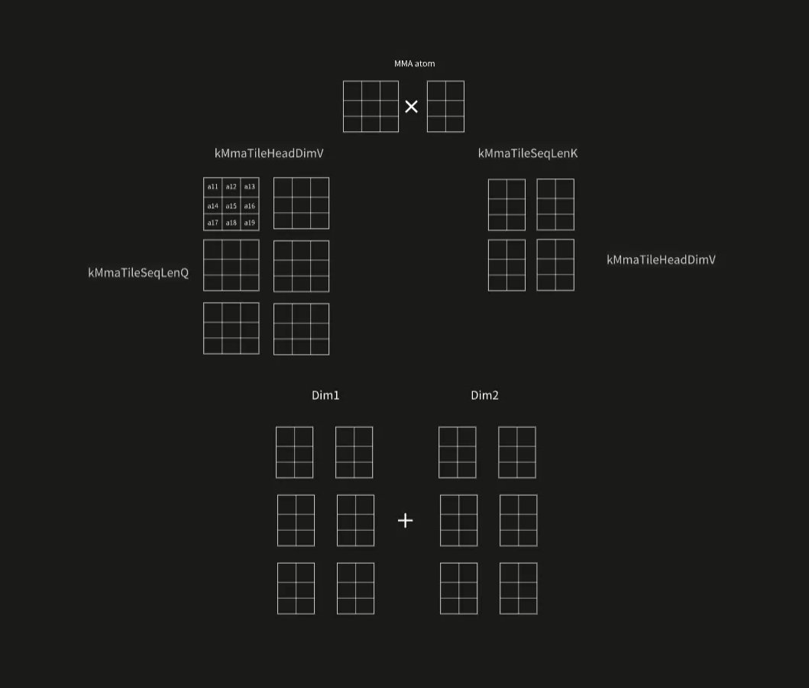
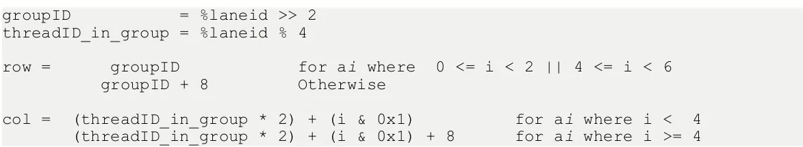
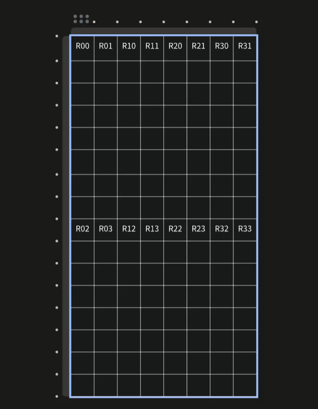

## 1.按照query的维度拆分Tensor

### 1.1. 根据dim和流水线的长度,利用模板传递参数

```c++

  if (stages > 1) 
  {
    switch (d) 
    {
    case 32:
      launch_flash_attn_mma_stages_split_q<32, 2>(Q, K, V, O);
      break;
    case 64:
      launch_flash_attn_mma_stages_split_q<64, 2>(Q, K, V, O);
      break;
    case 96:
      launch_flash_attn_mma_stages_split_q<96, 2>(Q, K, V, O);
      break;
    case 128:
      launch_flash_attn_mma_stages_split_q<128, 2>(Q, K, V, O);
      break;
    default:
      throw std::runtime_error("headdim not support!");
      break;
    }
  } 
```

- 这里也是我们经典常用的一个算子小技巧,利用模板传递参数

### 1.2 MMA原子形态

```c++

constexpr int kMmaAtomM = 16;
constexpr int kMmaAtomN = 8;
constexpr int kMmaAtomK = 16;

constexpr int kMmaTileSeqLenQ = (kHeadDim < 128) ? 4 : 4;
constexpr int kMmaTileSeqLenK = 1;
constexpr int kMmaTileSeqLenP = (kHeadDim < 128) ? 4 : 4;
```

- M N K 的设置,分别对应了输入行数,内积大小,输出维度
- 这是MMA的形态,通过参数的设置,让小的原子拼大块
- 并且用原子块的形态,在更大的角度上去拼接

### 1.3行距与kpad

```c++
constexpr int kPad = 8;  
const int smem_max_size =((Br * (kHeadDim + kPad)) + (kStage * Bc * (kHeadDim + kPad)) +
(Bc * (kHeadDim + kPad))) * sizeof(half);
```

- 这里防止32对齐是为了减少内存事物的冲突,

### 1.4分块矩阵乘法



- 在我们的Q @ K^T 的运算中
- 沿着K方向是最终矩阵的横坐标,沿着Q是最终矩阵的纵坐标,我们只需要将所有的Dim分别进程分块乘法
- 最终得到的矩阵进行求和,就可以获得我们的分块矩阵求和的最终结果,
- 这也是基本原理 

这里要注意进行区分,我们是把所有的dim计算完成,然后再进行我们的分块的softmax的计算!

### 1.5核函数的定义

```c++
  // Each block covers one Br x Bc tile
  dim3 grid(div_ceil(QKV_seqlen, Br), QKV_batch * QKV_head);
  dim3 block(kNumThreads); // 4/8 warps per block 
//constexpr int kNumThreads =  WARP_SIZE*kMmaTileSeqLenQ*kMmaTileSeqLenK;
```

- 我们让一个block处理一个Br块进行我们的计算过程(一个Br 对应全部的Bc块+全部的BlockDim)
- 这里的概念要进行区分开来
- 但是线程束的数量是 WARP_SIZE*kMmaTileSeqLenQ*kMmaTileSeqLenK
- 这就意味着32个线程负责一个aton操作!

## 2.共享内存的定义

```c++
  half *Q_tile_smem = smem;                      
  half *K_tile_smem = Q_tile_smem + Q_tile_size; 
  half *V_tile_smem = K_tile_smem + kStage * KV_tile_size;

  uint32_t smem_Q_base_ptr = __cvta_generic_to_shared(Q_tile_smem);
  uint32_t smem_K_base_ptr = __cvta_generic_to_shared(K_tile_smem);
  uint32_t smem_V_base_ptr = __cvta_generic_to_shared(V_tile_smem);
```

- 这里我们需要准备两段K内存,一段预取,一段用作计算(将计算资源和内存资源混合利用)
- 然后将smem转换成 PTX能够识别的模式(global标识符号)

## 3.将gmem_Q 加载到smem_Q (整个过程只用加载一次)

```c++

#define CP_ASYNC_CG(dst, src, bytes)                                           \
  asm volatile(                                                                \
      "cp.async.cg.shared.global.L2::128B [%0], [%1], %2;\n" ::"r"(dst),       \
      "l"(src), "n"(bytes))

#define CP_ASYNC_COMMIT_GROUP() asm volatile("cp.async.commit_group;\n" ::)

{
	int load_gmem_Q_d = load_smem_Q_d;
    int load_gmem_Q_addr = (Q_gmem_offset + load_gmem_Q_Br * kHeadDim + load_gmem_Q_d);
    uint32_t load_smem_Q_ptr = (smem_Q_base_ptr + (load_smem_Q_Br * (kHeadDim + kPad) + load_smem_Q_d) * sizeof(half));
    #pragma unroll
    for (int i = 0; i < (kHeadDim / (kNumThreads / Br)); i += 8) 
      CP_ASYNC_CG(load_smem_Q_ptr + i * 2, &Q[load_gmem_Q_addr + i], 16);
    CP_ASYNC_COMMIT_GROUP();
}
```

- 这里用了汇编指令去拷贝,核心目的是让拷贝内容更多的吃L2(更大更稳定)

## 4.按照BC和stage加载smem_K

```c++
  // 将 K 从 gmem 载入 smem，预取 (kStage - 1) 个 K^T tile，[d,Bc]
  if constexpr (kStage > 1) 
  {
    #pragma unroll
    for (int stage = 0; stage < (kStage - 1); ++stage) 
    {
      load_gmem_K_Bc_offset = stage * Bc; // 例如 (0~3)*64=(0,64,128,192,...)
      int load_gmem_K_Bc = load_gmem_K_Bc_offset + load_smem_K_Bc; // 小于序列长度

      int load_gmem_K_d = load_smem_K_d; // K [Bc,d] 来自 [seqlen,d]
      int load_gmem_K_addr = (K_gmem_offset + load_gmem_K_Bc * kHeadDim + load_gmem_K_d);

      uint32_t load_smem_K_ptr =
          (smem_K_base_ptr +
           (stage * KV_tile_size + load_smem_K_Bc * (kHeadDim + kPad) +
            load_smem_K_d) *
               sizeof(half));

      #pragma unroll
      for (int i = 0; i < (kHeadDim / (kNumThreads / Bc)); i += 8) {
        CP_ASYNC_CG(load_smem_K_ptr + i * 2, &K[load_gmem_K_addr + i], 16);
      }
      CP_ASYNC_COMMIT_GROUP();
    }
  }

  if constexpr (kStage > 1) {
    CP_ASYNC_WAIT_GROUP(kStage - 2); // 阶段映射：s2->0, s3->1, s4->2
    __syncthreads();
  }

```

- 这里我们是一次加载一个Bc的K序列
- 然后最后等待的时候,只允许有一组没完成
- 同时,这里在gmem里面加载是按照`stag * Bc` 进行预取


## 5.内循环

### 5.1 预取当前阶段的V和下一阶段的K

```c++
if ((tile_K_seqlen + 1) < Tc) 
{
	load_gmem_K_Bc_offset = (tile_K_seqlen + 1) * Bc; // 例如 (0~3)*64=(0,64,128,192,...)
    int load_gmem_K_Bc = load_gmem_K_Bc_offset + load_smem_K_Bc; // 小于序列长度
    int load_gmem_K_d = load_smem_K_d; // K [Bc,d] 来自 [seqlen,d]
    int load_gmem_K_addr = (K_gmem_offset + load_gmem_K_Bc * kHeadDim + load_gmem_K_d);
        
        //后面要确定的是线程负责的位置了
        uint32_t load_smem_K_ptr =
            (smem_K_base_ptr +
             (smem_sel_next * KV_tile_size +
              load_smem_K_Bc * (kHeadDim + kPad) + load_smem_K_d) *
                 sizeof(half));
#pragma unroll
        for (int i = 0; i < (kHeadDim / (kNumThreads / Bc)); i += 8) {
          CP_ASYNC_CG(load_smem_K_ptr + i * 2, &K[load_gmem_K_addr + i], 16);
        }
        CP_ASYNC_COMMIT_GROUP();
}

      {
        load_gmem_V_Bc_offset =
            tile_K_seqlen * Bc; // 例如 (0~3)*64=(0,64,128,192,...)
        int load_gmem_V_Bc = load_gmem_V_Bc_offset + load_smem_V_Bc;
        int load_gmem_V_d = load_smem_V_d;
        int load_gmem_V_addr =
            (V_gmem_offset + load_gmem_V_Bc * kHeadDim + load_gmem_V_d);
        uint32_t load_smem_V_ptr =
            (smem_V_base_ptr +
             (load_smem_V_Bc * (kHeadDim + kPad) + load_smem_V_d) *
                 sizeof(half));
#pragma unroll
        for (int i = 0; i < (kHeadDim / (kNumThreads / Bc)); i += 8) {
          CP_ASYNC_CG(load_smem_V_ptr + i * 2, &V[load_gmem_V_addr + i], 16);
        }
        CP_ASYNC_COMMIT_GROUP();
      }


```

- 这里我们取用当前阶段的V和下一阶段的K,都是在用前面的汇编异步操作

```c++
    #pragma unroll
    for (int tile_K_d = 0; tile_K_d < (kHeadDim / kMmaAtomK); ++tile_K_d) 
        #pragma unroll
        for (int i = 0; i < kWarpTileSeqLenQ; ++i) // Q[Br,d]=[M,K] 的片段
```

- 外层遍历是遍历dim
- 内层是遍历一个warp内有多少个tile块

### 5.2将当前线程负责的元素存入寄存器之中

```c++
          int warp_smem_Q_Br = warp_QP * (kMmaAtomM * kWarpTileSeqLenQ) + i * kMmaAtomM;
          int lane_smem_Q_Br = warp_smem_Q_Br + lane_id % 16;            // 0~15
          int lane_smem_Q_d = tile_K_d * kMmaAtomK + (lane_id / 16) * 8; // 0,8
          uint32_t lane_smem_Q_ptr =
            (smem_Q_base_ptr +
             (lane_smem_Q_Br * (kHeadDim + kPad) + lane_smem_Q_d) *
                 sizeof(half));
          //一个线程处理八个元素,那么就是4个寄存器
          LDMATRIX_X4(R_Q[i][0], R_Q[i][1], R_Q[i][2], R_Q[i][3],
                    lane_smem_Q_ptr); // 写入寄存器 R_Q
```

- 每个寄存器存放两个元素,一共是八个元素

### 5.3在不同的dim上累加,得到归约结果

```c++
        #pragma unroll
        for (int i = 0; i < kWarpTileSeqLenQ; ++i) 
        {
          #pragma unroll
          for (int j = 0; j < kWarpTileSeqLenK; ++j) 
          {
            //这里需要进行累加的原因是dim 维度的原因
            HMMA16816(R_S[i][j][0], R_S[i][j][1], R_Q[i][0], R_Q[i][1], R_Q[i][2],
                    R_Q[i][3], R_K[j][0], R_K[j][1], R_S[i][j][0],
                    R_S[i][j][1]);
          }
        }
```






