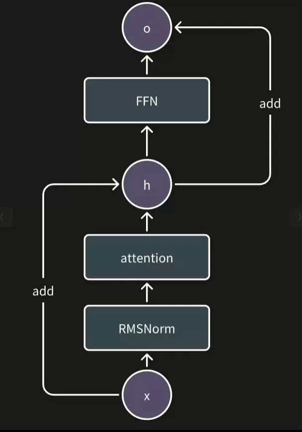

## 1.llama2_transformer_block计算流程图



## 2.计算k v q矩阵，保存KVCache

### 2.1RMS Norm归一化计算：

```c++
  auto rmsnorm_output = get_buffer(ModelBufferType::kOutputRMSNorm);
  STATUS_CHECK(query_layer->forward(rmsnorm_output, query));
```

### 2.2获取相应的将当前的Query值 写入KV Cache矩阵

```c++
const auto& [key, val] = slice_kv_cache(layer_idx, pos);
  
const auto& key_layer = llama_layers_->wk_layers_.at(layer_idx);
CHECK_NE(key_layer, nullptr) << "The key layer in the attention block is null pointer.";
STATUS_CHECK(key_layer->forward(rmsnorm_output, key));
// value
const auto& value_layer = llama_layers_->wv_layers_.at(layer_idx);
CHECK_NE(value_layer, nullptr) << "The value layer in the attention block is null pointer.";
STATUS_CHECK(value_layer->forward(rmsnorm_output, val));
```

这里我这直接将KV Cache `tensor`管理的buffer提取出来单独赋值。

### 2.3添加旋转位置编码，完成k v q矩阵计算

```c++
// rope
CHECK_NE(llama_layers_->rope_layer_, nullptr)<< "The RoPE layer in the attention block is null pointer.";
STATUS_CHECK(llama_layers_->rope_layer_->forward(query, key, pos_tensor, get_buffer(ModelBufferType::kSinCache),get_buffer(ModelBufferType::kCosCache), tensor::Tensor{}));
```

## 3.mha_layer算子

### 3.1GPU算子

```c++
  multi_head_attention_kernel<<<head_num, thread_num, head_size * sizeof(float), stream>>>(pos, seq_len, query, score, output, key_cache, value_cache, kv_dim, kv_mul, head_num,head_size, layer_offset);
```

这里我们定义了一个`head`，一个`block`去处理

**先将`query` 拷贝到共享内存之中**

```c++
float* query_head = query + head * head_size;  
for (int i = threadIdx.x; i < head_size; i += blockDim.x) 
{
	s_query_head[i] = query_head[i];
}
__syncthreads();
```

因为这里是块内操作，所以要进行同步操作。不过在移动之前，我们要对query进行对齐操作。

**计算自注意力分数**

```c++
  float* score_head = score_ptr + head * seq_len;

  int head_offset = (head / kv_mul) * head_size;

  for (int t = threadIdx.x; t <= pos; t += blockDim.x) 
  {
    float* key_head = key_cache + layer_offset + t * kv_dim + head_offset;

    float score = 0.0f;
    for (int i = 0; i < head_size; i += 4) 
    {
      float4 key_val = *reinterpret_cast<float4*>(key_head + i);
      float4 query_val = *reinterpret_cast<float4*>(s_query_head + i);

      score += key_val.x * query_val.x + key_val.y * query_val.y + key_val.z * query_val.z +
               key_val.w * query_val.w;
    }

    score *= scale;
    score_head[t] = score;
  }
__syncthreads();
```

注意这里head的偏移，要加上layer层偏移，total_seq的偏移和head分组的偏移（这里注意GQA，多个query共用一个value和key矩阵），这里依旧采用float4减少内存块的访问。最后乘以我们的缩放因子即可。

注意这里我们没有对score_head进行归约，而是将值保存下来，因为我们输入的形状是[head,1,head_dim]，`score`矩阵的形状是[head,seq_len,head_dim],最后计算的矩阵的形状就是[head,seq_len],

```c++
  for (int i = threadIdx.x; i < head_size; i += blockDim.x) 
  {
    float value = 0.0f;
    for (int t = 0; t <= pos; t++) 
    {
      float* value_head = value_cache + layer_offset + t * kv_dim + head_offset;
      //不用担心dim的问题，实际上这里只有一个维度
      float score = score_head[t];
      value += score * value_head[i];
    }
    output_head[i] = value;
  }
```

最后我们让一个线程负责一行，注意这里的`KV Cache`并没有转置存储，所以我们这里要不断的计算`value_head` 的起始位置，最后得到我们的输出。

```c++

  __syncthreads();

  softmax_gpu(score_head, pos + 1);
  __syncthreads();

  float* output_head = output + head * head_size;
  // 使用自注意力分数对value矩阵加权
  for (int i = threadIdx.x; i < head_size; i += blockDim.x) {
    float value = 0.0f;
    for (int t = 0; t <= pos; t++) {
      float* value_head = value_cache + layer_offset + t * kv_dim + head_offset;
      float score = score_head[t];
      value += score * value_head[i];
    }
    output_head[i] = value;
  }
}
```

## 4. attention_mha

### 4.1从模型中获取缓存，存储计算的中间变量

```c++
  tensor::Tensor key_cache = get_buffer(ModelBufferType::kKeyCache);
  // VAL = [val1,val2,...val t]
  // output @ VAL = 最终的结果
  tensor::Tensor val_cache = get_buffer(ModelBufferType::kValueCache);

  tensor::Tensor mha_output = get_buffer(ModelBufferType::kOutputMHA);
  tensor::Tensor score_storage = get_buffer(ModelBufferType::kScoreStorage);
  tensor::Tensor query = this->get_buffer(ModelBufferType::kQuery);
```

### 4.1mha_layer的初始化与前向传递

```c++
  const auto& mha_layer = llama_layers_->mha_layer_;
  CHECK_NE(mha_layer, nullptr) << "The multi head attention layer is null pointer.";
  int pos = pos_tensor.index<int32_t>(0);
  std::dynamic_pointer_cast<op::MultiHeadAttention>(mha_layer)->set_pos(pos);
  std::dynamic_pointer_cast<op::MultiHeadAttention>(mha_layer)->set_layer_idx(layer_idx);
  STATUS_CHECK(mha_layer->forward(query, score_storage, key_cache, val_cache, mha_output));
```

这里`mha_layer` 要传入对应的权重层和`pos` 判断KVCache的下界

### 4.2完成前向传递与维度对齐

```c++
  // wo @ attention output
  tensor::Tensor attn_output = get_buffer(ModelBufferType::kAttnOutput);
  const auto& wo_layer = llama_layers_->wo_layers_.at(layer_idx);
  CHECK_NE(wo_layer, nullptr) << "The weight output layer is null pointer.";
  STATUS_CHECK(wo_layer->forward(mha_output, attn_output));
```

我们把张量分成了多个头，但是这里会出现`head_num` * `head_size` < `tenser_dim` 的情况，所以这里我们需要重新进行维度对齐 

## 5. 总结：

- transformer_block计算的过程中注意存储KVCache。
- 多头 + KvCache实际上伴随着复杂的指针偏移计算。
- 残差计算意味着需要模型中间缓存张量的支持。


