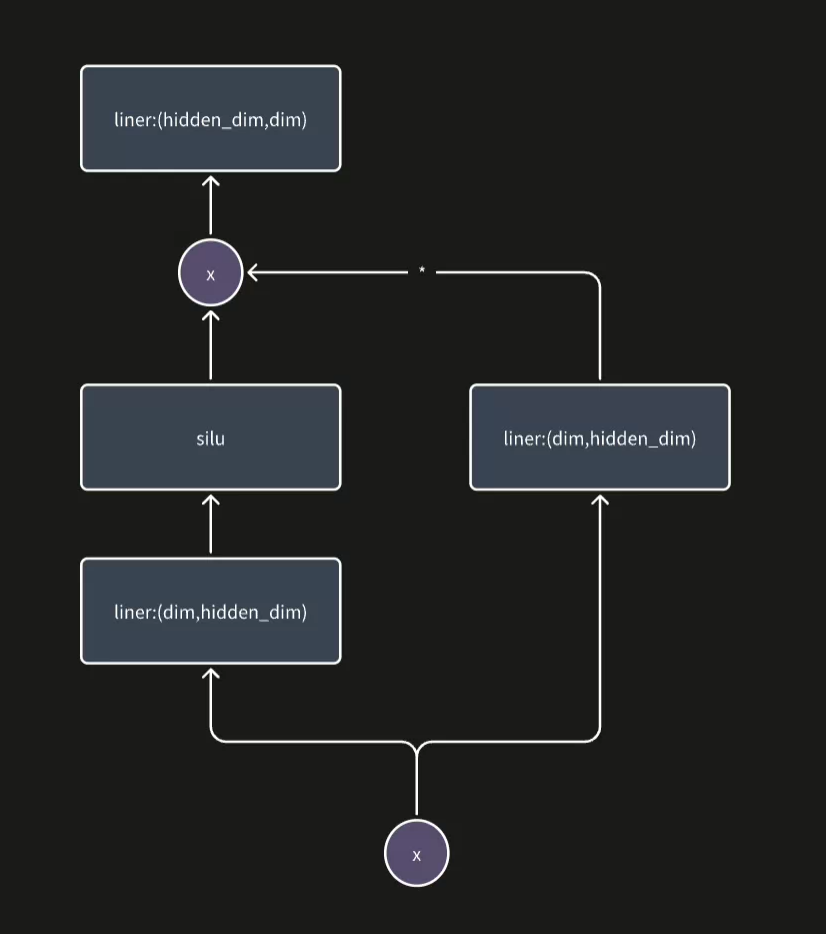

## 1.llama2中ffn的计算流程

```python

class FeedForward(nn.Module):
    def __init__(
        self,
        dim: int,
        hidden_dim: int,
        multiple_of: int,
        ffn_dim_multiplier: Optional[float],
    ):
        super().__init__()
        hidden_dim = int(2 * hidden_dim / 3)
        if ffn_dim_multiplier is not None:
            hidden_dim = int(ffn_dim_multiplier * hidden_dim)
        hidden_dim = multiple_of * ((hidden_dim + multiple_of - 1) // multiple_of)

        self.w1 = ColumnParallelLinear(
            dim, hidden_dim, bias=False, gather_output=False, init_method=lambda x: x
        )
        self.w2 = RowParallelLinear(
            hidden_dim, dim, bias=False, input_is_parallel=True, init_method=lambda x: x
        )
        self.w3 = ColumnParallelLinear(
            dim, hidden_dim, bias=False, gather_output=False, init_method=lambda x: x
        )

    def forward(self, x):
        return self.w2(F.silu(self.w1(x)) * self.w3(x))

```

整体的计算流程如下图：




## 2.swiglu_kernel算子的实现

siLU的公式为
$$
\mathrm{SiLU}(x) = x \cdot \sigma(x)
$$

$$
\sigma(x) = \frac{1}{1 + e^{-x}}
$$

SwiGLU 是在 FFN（前馈网络）中使用的“门控激活结构”，它由两条线性变换分支构成，其中一条经过 `SiLU` 激活，然后与另一条逐元素相乘。也就是我们在上图中的向量乘法的那个操作的部分。

**GPU版本**

```c++
__global__ void swiglu_kernel_cu_fp32(int size, const float* in1, const float* in2, float* out) {
  int idx = threadIdx.x + blockDim.x * blockIdx.x;
  if (idx >= size) return;

  float x1 = in1[idx];
  float x2 = in2[idx];

  float value = 1.0f / (1.0f + expf(-x1));
  float silu = x1 * value;
  out[idx] = silu * x2;
}
```

这里的并行是一个线程处理一个位置的数据。

**CPU版本**

```c++
void swiglu_kernel_cpu(const tensor::Tensor& input1, const tensor::Tensor& input2,
                       const tensor::Tensor& output, void* stream) {
  UNUSED(stream);
  CHECK_EQ(input1.is_empty(),false);
  CHECK_EQ(input2.is_empty(),false);
  CHECK_EQ(output.is_empty(),false);

  CHECK(input1.device_type() == base::DeviceType::kDeviceCPU);
  CHECK(input2.device_type() == base::DeviceType::kDeviceCPU);
  CHECK(output.device_type() == base::DeviceType::kDeviceCPU);

  arma::fvec input1_vec(const_cast<float*>(input1.ptr<float>()), input1.size(), false,
                        true);
  arma::fvec input2_vec(const_cast<float*>(input2.ptr<float>()), input2.size(), false,
                        true);
  arma::fvec output_vec(const_cast<float*>(output.ptr<float>()), output.size(), false,
                        true);

  input1_vec %= (1.0f / (1.0f + arma::exp(-input1_vec)));
  output_vec = input1_vec % input2_vec;
}
```

这一段代码实际上是在**利用 Armadillo（C++ 的线性代数库）**，把原始的 `float*` 数组或 OpenCV / Tensor 数据包装成 `arma::fvec`（单精度浮点向量）对象，从而方便地使用 Armadillo 提供的矩阵和向量运算接口。

**Armadillo**是一个高层次的C++线性代数哭，目标是提供MATLAB一样的语法风格的数据，是一个智能封装层，在背后调用高度优化的数学库。


