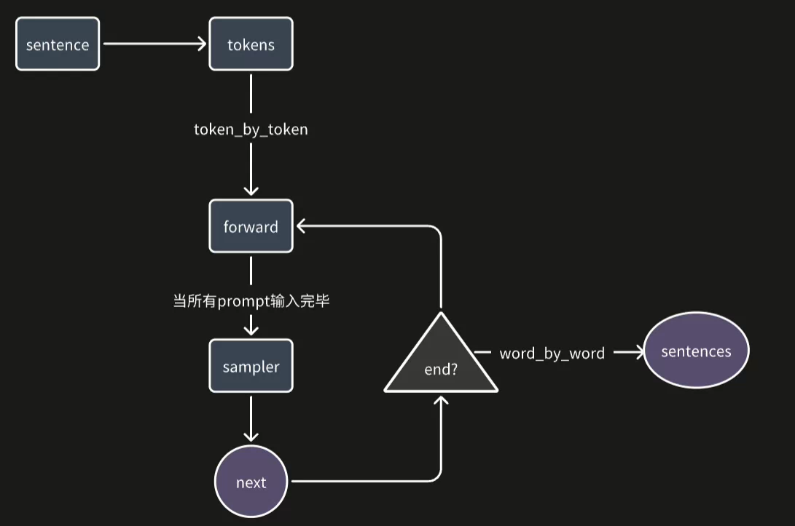

## 1.前言：

有没有想过，为什么大模型的推理和输出都是一个字一个字像流式一样生成的，其实这和推理系统的工作原理(token-by-token)分不开。下面本篇文章将会以一个简易的推理系统为例，为llama2的推理全过程做一个总结。

## 2.调用分词器解码：

```c++
auto tokens = model.encode(sentence);

int32_t prompt_len = tokens.size();
LOG_IF(FATAL, tokens.empty()) << "The tokens is empty.";

int32_t pos = 0;
int32_t next = -1;
bool is_prompt = true;
```

这里先调用分词器，将我们的句子`[我喜欢踢足球。]`变成`[我, 喜欢, 踢, 足球, 。]`然后将拆成的词汇变成token_id`[3，43，534，3421，32]`。在输入模型之前，会调用模型的`embedding`层，其实就是吧`token_id` 看成行索引去提取高纬度的消息。`const auto& prompt_embedding = model.embedding(tokens);`

## 3.逐token输入，forward传递

```c++
pos_tensor.index<int32_t>(0) = pos;
if (pos < prompt_len - 1) 
{
    tensor::Tensor input = model.fill_input(pos_tensor, prompt_embedding, is_prompt);
    model.predict(input, pos_tensor, is_prompt, next);
} 
else
{
    is_prompt = false;
    tokens = std::vector<int32_t>{next};
    const auto& token_embedding = model.embedding(tokens);
    tensor::Tensor input = model.fill_input(pos_tensor, token_embedding, is_prompt);
    model.predict(input, pos_tensor, is_prompt, next);
}
```

这里的`pos`能帮助我们很好的记录`kvCache`的索引，`next` 是我们模型经过采样器之后筛选的下一个token_id,在所有`prompt`输入完之前,模型生成的`next` 都是可以忽略的，反之，则将模型输出的`token` 再放回进行输入，作为自回归的结果。最后只用判断`next` 是否为终止符号，即可停止输出。

## 4.总结

