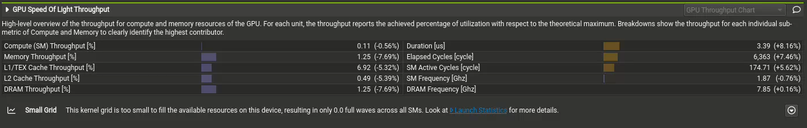
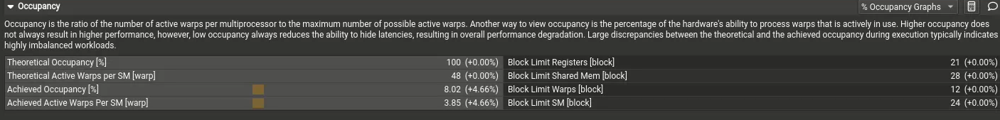

## 1.生成启动报告

```bash
sudo /usr/local/cuda/bin/ncu 
--metrics smsp__sass_average_branch_targets_threads_uniform.pct,  \
smsp__sass_thread_inst_executed_op_control_pred_on.sum  \ 
-o dist   \
./a.out   \
```

  这里就可以生成我们的程序启动报告，ncu最好在sudo的模式下运行，因为nvprofile好像到后面就不在支持nvcc的高版本运行了，所以这里我们如果需要对一些指标进行分析，可以参考这份文档https://docs.nvidia.com/nsight-compute/2024.1/NsightComputeCli/index.html#nvprof-transition-guide，记录了新旧元素对照表。

```bash
sudo /usr/local/cuda/bin/ncu     --kernel-name "regex:(?i).*rmsnorm.*"  -o profile ./llama_infer  ~/project-src/KuiperLLama/models/stories110M.bin ~/project-src/KuiperLLama/models/tokenizer.model

```

## 2. 分析

接着，我们可以调用我们的可视化ui来对程序进行性能分析。



1. `Elapsed Cycle` 表示核函数执行过程中经过的总周期数目，Duration,核函数执行的时间总数

2. `compute Throught` 计算吞吐量，GPU有没有被打满，是不是一直在工作

   - 100% = GPU 的算力完全被使用，没有空闲；

   - 50% = GPU 计算单元只有一半时间在干活；

   - 0% = 没有计算负载（完全等待或受限于内存/同步等）。

3. `Memory Throught`  访问的带宽和实际的带宽的占比，

   - 高了：核函数受限于内存访问了
   - 低了：缓存命中很低

总结：内存的利用率，都是实际的平均访问数据宽带/理论最大的数据访问宽带，就是代表该内存有没有高负荷的运转



1. `Theoretical Occupancy` 理想情况下，每个SM能够主流的线程上限比（主要与block size）的大小相关
2. `Achieved Occupancy` 实际上，每个sm上活跃的线程数目
3. `Theoretical Active Warps per SM` 每个SM最多支持多少个warp
4. `Achieved Active Warps per SM ` 实际上每个sm上只有不到4个warp

这些数据结合我们的sm总数，可以推出当前的sm的活跃总数，通过这个，合理的设置每个block的大小，进行调度计算，同时也要考虑（一个block只能留在一个sm上）

## 3. 总结

  初步体验了ncu去跑我们的程序，还可以结合nsys，nsys更好看总时间线上，内核有没有跑满，但是ncu上可以看单独的内核上，计算的吞吐量，看出内存对程序的影响大小。不过我们最好列出一些单独的测试程序，直接测试llm的推理，最后会生成很多的kernel，从而打乱干扰我们的计算。
