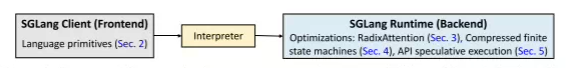
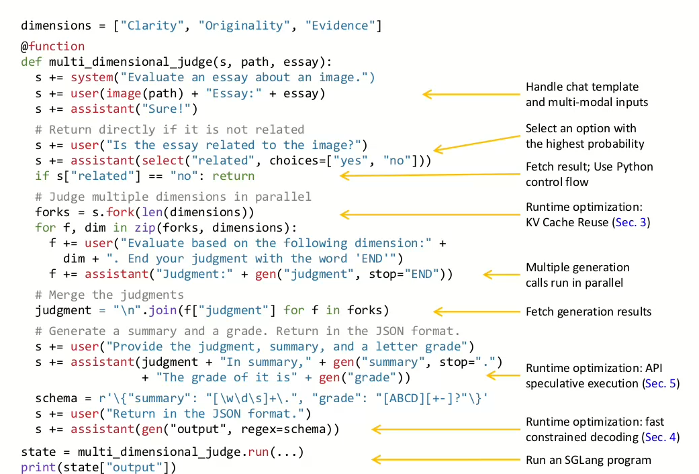
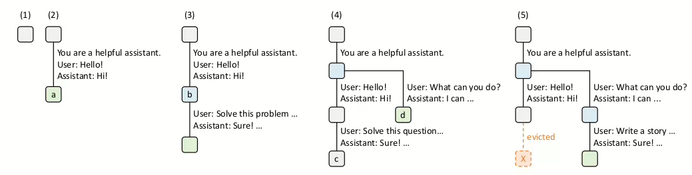
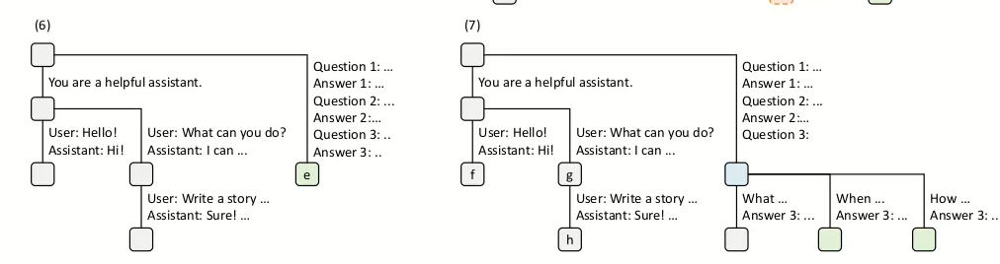
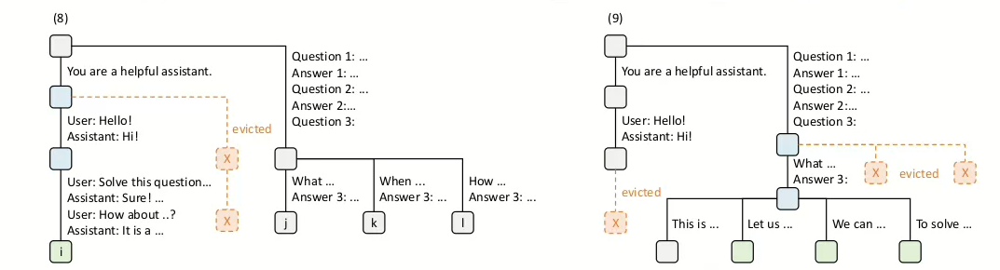
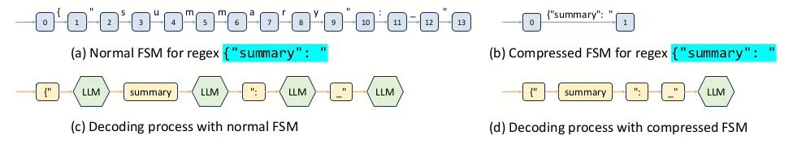

## 1. sglang安装

```bash
git clone -b v0.5.4.post2 https://github.com/sgl-project/sglang.git
cd sglang
pip install -e "python[dev]"
```

为了方便学习，我们采用源码安装的方式，并且“**可编辑模式 (editable mode)**”安装当前项目，方便我们后续进行二次开发与实践。

## 2.启动sglang服务

```python
from sglang.test.doc_patch import launch_server_cmd
from sglang.utils import wait_for_server, print_highlight, terminate_process
# This is equivalent to running the following command in your terminal
# python3 -m sglang.launch_server --model-path qwen/qwen2.5-0.5b-instruct --host 0.0.0.0
server_process, port = launch_server_cmd(
    """
python3 -m sglang.launch_server --model-path qwen/qwen2.5-0.5b-instruct \
 --host 0.0.0.0 --log-level warning
"""
)
wait_for_server(f"http://localhost:{port}")
```

SRT服务器由**HTTP服务端**和**推理引擎**组成。SGLang不仅仅只是一个模型的推理引擎，而是一个能**解释执行LLM程序的运行时系统**。（解析prompt，执行LLM原语，管理KV Cache，请求队列，分布式上下文，批处理多请求）。



如图所示，SGLang主要由两个部分组成

1. 前端语言：用比简化程序的编写（**提供了用于文本生成和并行控制的基础原语，使用原生的python语法轻松地开发复杂的prompt设计流程和多步生成逻辑**）。
2. 后端运行时候：用于加速这些程序的执行。

同时，针对这种设计，SGlang提供一个解释器和编译器：

- 解释器将提示状态作为一个流来管理，并将原语操作提交到该流中异步执行，确保程序内部的同步与并行执行得到正确控制
- 追踪并编译：更高效的后端（KV Cache 合并多个生成式的任务）

## 2.多维度作文评测器

在 SGLang 中实现的 **多维度作文评测器（multi-dimensional essay judge）** 使用了 **分支–求解–合并（branch-solve-merge）提示技术**。

- 分支：把一个复杂问题拆成多个维度
- 求解：每个分支的子任务由LLM独立执行，即在不同的上下文中生成答案，评分或中间推理结果
- 合并：将所有的分支结果收集起来，通过后续的prompt或者程序逻辑进行整合与总结。

## 3.编程模型



在`DSL` 中，可以通过`+=` 运算符将新的字符串和`SGLang`原语添加到状态`s`中加以执行。后面，我们将提示分叉成为三个副本，以便从不同的维度加以评估，最后合并这些评估结果，生成总结。

执行`SGLang` 程序最简单的方式是通过解释器。在这种模式下，提示器被视为一个异步流，直到需要获取结果的时候，程序会阻塞直到结果准备就绪，以确保正确的同步。另外，SGLang程序也可以被编译为计算图，用于进一步优化与高效的执行。

## 4.基于RadixAttention 的高效KV 缓存复用

SGLang解决的问题：多喝在多次调用喝多个实例之间高效复用KV 缓存。
RadixAttention 是一种新颖的运行时技术，可以再程序执行期间实现自动且系统的KV缓存复用，系统将KV缓存保存在一个基数树中，从而支持高效的前缀搜索，复用，插入和淘汰。
关键词：`LRU` `基于缓存感知的调度策略`

### 4.1基数树

相比于前缀树，基数树的每条边可以表示多个字符。使用基数数来管理`token` 序列预期对应的KV缓存张量之间的映射关系。这些KV缓存张量采用`非连续的分页布局` 存储，其中每一页的大小都对应于一个token。并且引入一种简单的LRU缓存淘汰策略，优先淘汰最近最少使用的叶子节点



1. 初始时候，基数树为空
2. 服务器接收到一个用户消息 `"Hello"`，并返回 LLM 的输出 `"Hi"`。系统提示词 `"You are a helpful assistant"`、用户消息 `"Hello!"`、以及模型回复 `"Hi!"`被整合成了一个单独的边，并链接到了一个新的节点。
3. 一个新的提示（prompt）到达。服务器在基数树中找到了该提示的前缀（即对话的第一轮），并**复用了对应的 KV 缓存**。新的对话轮次被追加到树上，形成一个新节点。
4. 为了让两个聊天会话能够**共享系统提示（system prompt）**，将步骤 (3) 中的节点 “b” 拆分成了两个节点。（基数树是能够进行拆分的呀！）
5. 由于显存限制，需要**淘汰节点 “c”**（来自步骤 (4)）。新的对话轮次被追加到步骤 (4) 中的节点 “d” 之后。



6. 服务器接收到一个**少样本学习（few-shot learning）**查询，请求被处理并插入到基数树中。由于该新查询与现有节点没有任何前缀重合，根节点被拆分。
7. 服务器又收到了**一批新的少样本学习请求**。这些请求共享同一组少样本示例，因此将步骤 (6) 中的节点 “e” 拆分，
    以便这些请求能**共享相同的前缀缓存**。



8. 服务器收到了第一个聊天会话的新消息。由于第二个聊天会话（节点 “g” 和 “h”）是**最近最少使用的（least recently used）**，它们被淘汰以释放空间。
9. 服务器收到一个请求，要求对步骤 (8) 中节点 “j” 的问题进行**多答案采样（self-consistency prompting）**。
    为这些请求腾出空间，系统**淘汰了节点 “i”、“k” 和 “l”**。

基数树的结构被存储在CPU上，其开销可以忽略不计，`前端解释器` 会将完整的提示发给运行时，而运行时负责执行前缀匹配和缓存复用的操作。在执行`fork` 原语的时候，前端会`优先发送提示的前缀部分` 作为一种提示，随后前端在发送剩余的提示内容。

## 5. 缓存感知调度：

$$
\frac{KV Cache缓存中存储了多少个已经处理过的提示}{总共的prompt}
$$

当等待队列中有大量的请求的时候，他们的执行会显著影响`缓存命中率` 如果请求调度器频繁地在不同，无关的请求之间切换，可能会导致缓存都懂，从而让命中率降低。
为此，缓存感知调度的目的是：提高缓存命中率，优先处理匹配前缀更长的请求，而不是先到的服务。
(虽然贪心的缓存感知调度可以提高吞吐量，但是会导致某些请求被饥饿)

### 5.1 连续批处理下的RadixAttention 缓存感知调度

连续批处理：请求动态到达，系统不断收集等待队列中的请求，形成连续，可变大小的批次

```c++
Input:基数树 T、内存池 P、当前运行批次 B、等待队列 Q。
Output:已经完成请求并更新系统状态
	//从等待队列中获取所有的请求
    requests <- Q.get_all_requests()
    // 为所有等待中的请求查找前缀匹配
    for req ∈ requests do
        req.prefix_node,rep.prefix_len <- T.match_prefix(req.input_token)
    end for
    // 根据匹配的前缀长度对请求进行排序
    requests.sort()
    //T 中可被回收的缓存（没被任何使用） 和 P内存池中的剩余缓存
    available_size <- T.evictable_size() + P.avaliable_size()
    current_size <- 0
    new_branch <-[]
    for req ∈ requests do
        if req.size() + current_size < available_size then
            new_batch.append(req)
            delta <- T.increase_ref_counter(req.prefix_node)
            available_size <- availanle_size + delta
            current <- current_size + rep.prefix_len
            //所以这里其实少了一个current_size的维度
        end if
    endfor
    Q.remove_requests(new_batch)
    //将调度的队列加入正在运行的branch
    B.merge(new_batch)
    // 分配新内存，如有必要则进行回收
    needed_size ← B.needed_size()
    success,buffer <- P.alloc(need_size)
    if not success then
        //这里是我们的基数树进行回收内存
        T.evict(needed_size)
        success,buffer <- P.alloc(need_size)
    end if
    B.run(buffer)
    // Process finished requests
    finished_requests <-B.drop_finished_requests()
    for req ∈ finished_requests do
        //回收引用计数
        T.decrease_ref_counter(req.prefix_node)
        //基数树插入节点,基于本次的缓存
        T.insert(req)
    end for
    return finished_requests
        
```

核心思想：**最大缓存复用优先策略**。

## 6. 使用压缩有限状态机的高效受约束解码

### 6.1正则表达式与LLM

在语言模式的程序中，用户希望输出符合某种固定格式，正则表达式就是用来描述这种合法文本模式的工具。

### 6.2为什么用FSM

**将正则表达式转换为有限状态机（FSM）**

- 模型是逐token进行生成的
- 要判断当天的token是否符合regex，则需要再每一步匹配正则表达式
- 正则表达式匹配整个字符串通常是一次性的操作，不方便逐token检查
- 将正则表达式表示为状态机：生成过程中通过FSM状态来判断tken是否合法！！



所以这里无非就是识别的哪些是固定的，然后打包成为一个token直接塞给LLM。不用单token的进行输入（但是输出依然依赖我们的自回归），压缩边上的token可以在一次前向传播中传输。

## 7. 数据并行分布式RadixAttention

为了让`RadixAttention` 适应多副本的工作节点（数据并行）的分布式场景：

- 每个工作节点维护自己的子树
- 路由器维护一个元树，用于追踪所有的子树机器对应的设备

路由器会根据缓存的亲合度来进行前缀匹配，实施不同的策略：根据KV Cache的共享程度将请求交给不同的Cache

- 当工作节点发生更新的时候，会将更新操作交到队列，由路由器在低负载的期间处理，以更新元树。


