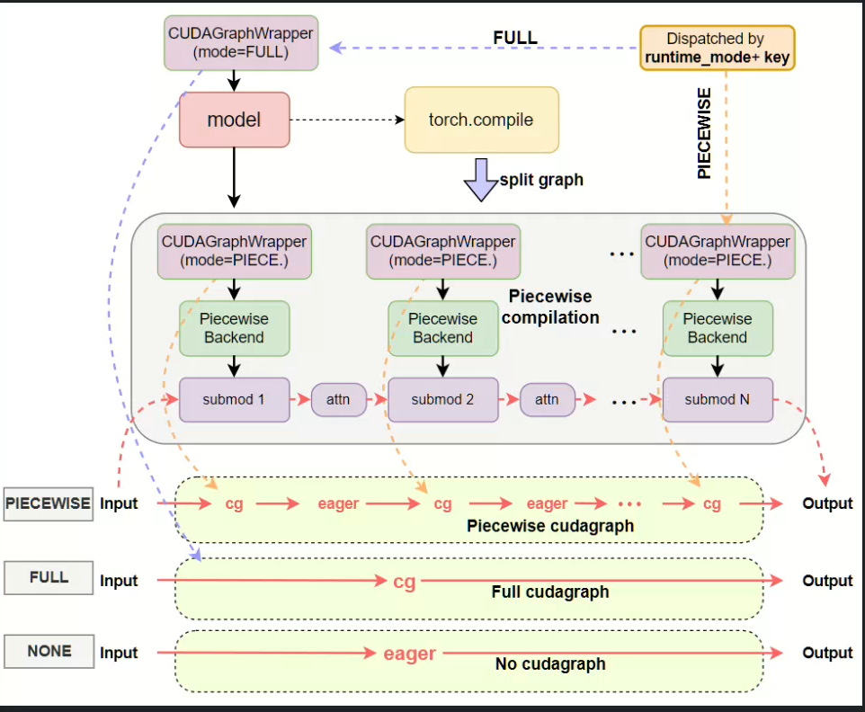
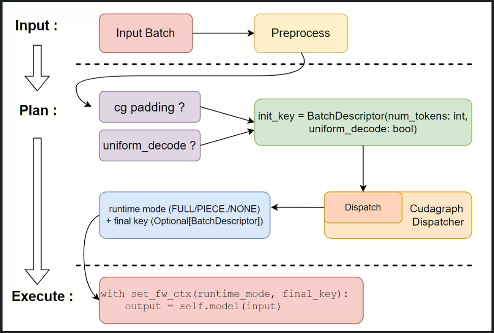
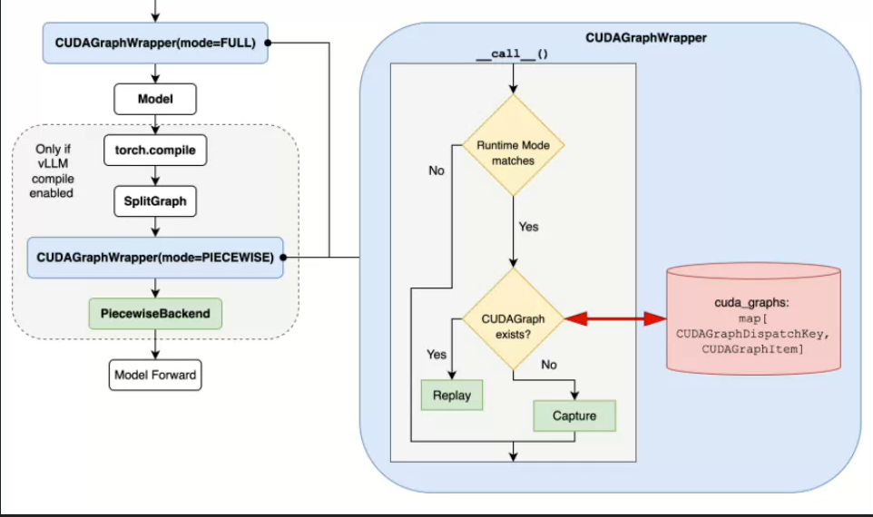

## 1.动机

### cudaGraph捕获

某些动态控制流（程序的执行路径在运行的时候才确定的）不能被捕获，cudaGraph更像是捕获了一个静态的流程图，以图的方式来减少核函数调用的成本，在vllm中cudaGraph的动机被设计成支持以下的特性：

- 针对不同批次类型进行明确捕获
  - prefill mixed decode
  - 可以针对不同的batch类型制定不同的捕获策略

- **将 CUDAGraph 捕获逻辑尽可能与编译分离**，实现功能正交性（使用同一个编译图同时捕获分段和完整 CUDA Graph，在不编译的情况下捕获完整 CUDA Graph）
  - cuda的捕获逻辑与模型的编译逻辑尽可能的独立
  - 模型的编译就是我们的算子
  - 编译图 = 编译后的模型执行计划 + kernel
  - cudagraph再根据编译图进行捕获
- 根据batch的组成在完整和分段的cuda graph之间切换
- 对cudaGraph进行集中管理

## 2. Eager和 Cuda Graph执行方式

| 特性               | Eager                    | CUDA Graph                                             |
| ------------------ | ------------------------ | ------------------------------------------------------ |
| **执行粒度**       | 单算子                   | 整个图或一段图（kernel 序列）                          |
| **性能**           | 较慢（每次调度开销大）   | 高效（调度开销几乎为零，GPU kernel launch 可直接复用） |
| **动态控制流支持** | ✅ 支持 Python 条件、循环 | ❌ 动态控制流不易捕获，需要分段或避开                   |
| **调试友好**       | ✅ 逐步调试容易           | ❌ Graph 内部难调试                                     |
| **重复执行**       | ❌ 每次都重新调度         | ✅ Graph 捕获后可多次重复执行                           |

## 3.设计细节

1. `CUDAGraphWrapper`: 封装器，用于处理被封装可调用对象的CUDA GRAPH捕获与重放（Graph的逻辑被分到这里，捕捉，通过运行时模式进行调度）
2. `CUDAGraphDispatcher` :核心控制类，负责在不同的Graph之间进行调度
3. `CUDAGRAPHMode` :用来描述支持的模式与运行时候的模式
4. `BatchDescriptor` :用于唯一表示运行时的batch的结构体，作为调度依据

## 4.模型执行器的工作流程

- batchDescriptor
  - 因为CUDA Graph要求输入shape保持不变，batch会进行填充
  - uniform_decode确定batch的seq长度是否相同（输入的张量必须和捕获时候一致（可能会不断地重新捕获？））

## 5.CUDAGraph逻辑

- 每个 wrapper 实例绑定到一个特定的 **runtime_mode**，仅限 **PIECEWISE** 或 **FULL**
- 负责 **捕获/重放 CUDA Graph**，同时在需要时直接调用原 runnable

这里是设计了一个缓存，缓存对应的调度键

- 在未命中的时候捕获
- 在命中的时候replay

## 6.总结

- 本质上工作都是围绕graph实例的缓存
- attention不能被记录，所以采取分段记录的方式
- vllm中一共有eager执行或者cg执行两种方式
