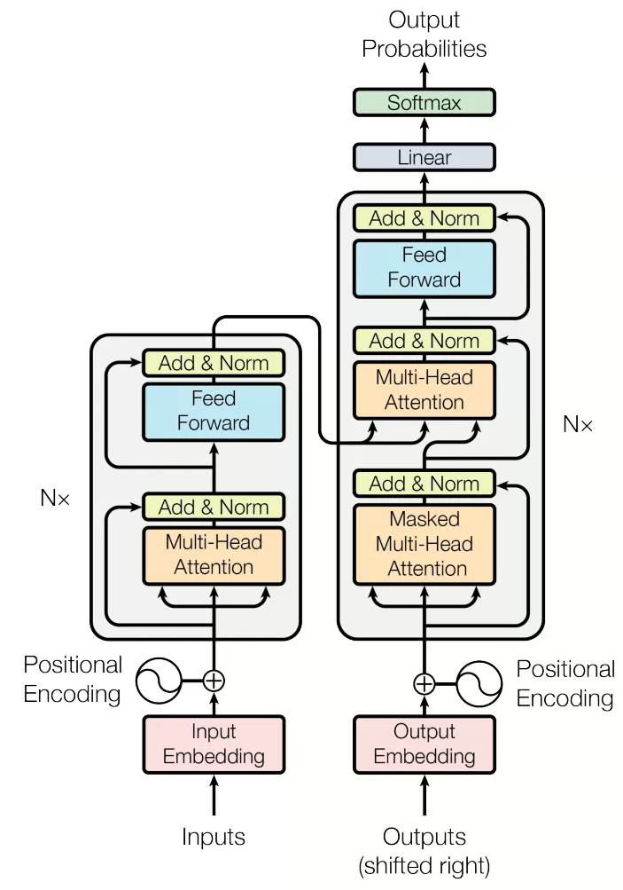
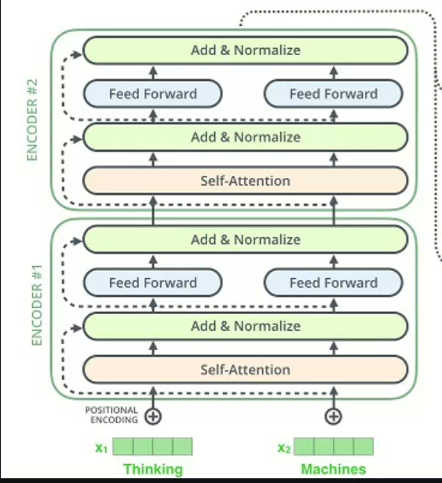
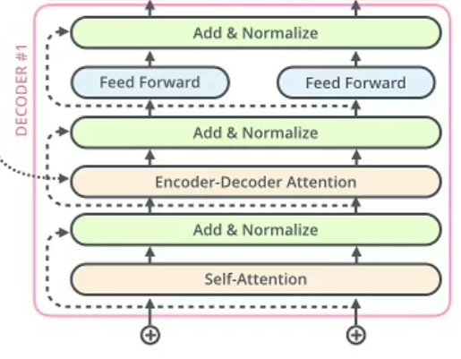

## 1.transformer结构图



  Transformer是目前很多大模型的基础，当我们想要为一个大模型打造推理系统的时候，了解它的模型结构是推理加速不可或缺的。下面我们将手写一个transformer以此来巩固我们的知识。

## 2. 缩放点积注意力

```python
class ScaleDotProductAttention(nn.Module):
    def __init__(self): 
        super(ScaleDotProductAttention,self).__init__()
        self.softmax = nn.Softmax(dim=-1)
    def forward(self,q,k,v,mask=None,e=1e-12):
        batch_size, head, length, d_tensor = k.size()
        k_t = k.transpose(2, 3) 
        score = (q @ k_t) / math.sqrt(d_tensor) 
        if mask is not None:
            score = score.masked_fill(mask ==0,-10000)
        score = self.softmax(score)
        v = score @ v
        return v,score
```

  首先我们要弄清楚三个张量`query` `key` `value`，它们的意义就是你要查询的是什么，你拥有的信息，你要获得的是什么。这里输入的形状都是` [batch_size, head, length, d_tensor]`  分别代表了同时在GPU上处理多少句话，注意力的头数，一句话的长度，一个词汇的向量。

  sorce这里的计算是一个矩阵乘法[length,d_tensor ] *[d_tensor,lenght ],最后得到[length,length]，这里实际上是我们的每个length对每个key的关注度，从而接下来去计算对应的value，根据关注度得到加权，也就是后面的`上下文感知量` v

## 3.多头注意力机制

```python
class MultiHeadAttention(nn.Module):
    def __init__(self, d_model, n_head):
        super(MultiHeadAttention, self).__init__()
        self.n_head = n_head
        self.attention = ScaleDotProductAttention()
        self.w_q = nn.Linear(d_model, d_model)
        self.w_k = nn.Linear(d_model, d_model)
        self.w_v = nn.Linear(d_model, d_model)
        self.w_concat = nn.Linear(d_model, d_model)
    def forward(self, q, k, v, mask=None):
        q, k, v = self.w_q(q), self.w_k(k), self.w_v(v)
        q, k, v = self.split(q), self.split(k), self.split(v)
        out, attention = self.attention(q, k, v, mask=mask)
        out = self.concat(out)
        out = self.w_concat(out)
        return out
    def split(self, tensor):
        batch_size, length, d_model = tensor.size()
        d_tensor = d_model // self.n_head
        tensor = tensor.view(batch_size, length, self.n_head, d_tensor).transpose(1, 2)
        return tensor
    def concat(self, tensor):
        batch_size, head, length, d_tensor = tensor.size()
        d_model = head * d_tensor
        tensor = tensor.transpose(1, 2).contiguous().view(batch_size, length, d_model)
        return tensor
```

  这里的多头的核心就是把q,k,v的tensor张量按照注意力的头数进行拆分，然后丢到我们的ScaleDotProductAttention中进行计算，所以这里的就是**减少tensor的维度，减小后面缩放点积矩阵乘的体积**，最后进行维度拼接，还原。

## 4.前馈神经网络

```python
class PositionwiseFeedForward(nn.Module):
    def __init__(self, d_model, hidden, drop_prob=0.1):
        super(PositionwiseFeedForward, self).__init__()
        self.linear1 = nn.Linear(d_model, hidden)
        self.linear2 = nn.Linear(hidden, d_model)
        self.relu = nn.ReLU()
        self.dropout = nn.Dropout(p=drop_prob)
    def forward(self, x):
        x = self.linear1(x)
        x = self.relu(x)
        x = self.dropout(x)
        x = self.linear2(x)
        return x
```

  Transformer的注意力层处理的是序列间的关系，但我们还需要对每个token的特征向量本身进行分线性变换，FFN就是对多头注意力网络的输出特征向量进行非线性变换

## 5.embedding

```python
from torch import Tensor
class TokenEmbedding(nn.Embedding):
    def __init__(self, vocab_size,d_model):
        super(TokenEmbedding,self).__init__(vocab_size,d_model,padding_idx=1)
```

  这里我们用torch自带的`Embedding` 类,相当于是一个形状为[vocab_size,d_model]的科学系权重矩阵，输入对应的vocab_id，就可以获得对应的embedding向量

```python
class PositionEmbedding(nn.Module):
    def __init__(self,d_model,max_len,device):
        super(PositionEmbedding,self).__init__()
        self.encoding = torch.zeros(max_len,d_model,device=device)
        pos = torch.arange(0,max_len,device=device)
        pos= pos.float().unsqueeze(dim=1)
        _2i = torch.arange(0,d_model,step=2,device=device).float()
        self.encoding[:,0::2] = torch.sin(pos/(10000**(_2i/d_model)))
        self.encoding[:,1::2] = torch.cos(pos/(10000**(_2i/d_model)))
    def forward(self,x):
        batch_size,seq_len = x.size()
        return self.encoding[:seq_len,:]
```

  在这里，巧妙地利用正弦函数，返回我们的位置编码，这里的pos才是我们真正的位置编码信息。

```python
class TransformerEmbedding(nn.Module):
    def __init__(self, vocab_size,d_model,max_len,drop_prob,device):
        super(TransformerEmbedding,self).__init__()
        self.token_emb = TokenEmbedding(vocab_size,d_model)
        self.pos_emb = PositionEmbedding(max_len,d_model,device)
        self.drop_out = nn.Dropout(p=drop_prob)
    def forward(self,x):
        tok_emb = self.tok_emb(x)
        pos_emb = self.pos_emb(x)
        return self.drop_out(tok_emb+pos_emb)

```

  Transformer的embedding的本质，传统的embedding加上我们的`positionembedding` 进行的一个组合

## 6.LayerNorm

```python
import torch
import numpy
import torch.nn as nn
import torch.nn.functional as F
class LayerNorm(nn.Module):
    def __init__(self,d_model,eps=1e-12):
        self.gamma = nn.Parameter(torch.ones(d_model))
        self.beta = nn.Parameter(torch.zeros(d_model))
        self.eps = eps
    def forward(self,x):
        mean = x.mean(-1,keepdim = True)
        var = x.var(-1, unbiased=False, keepdim=True)
        out = (x-mean) / torch.sqrt(var+self.eps)
        out = self.gamma*out + self.beta
        return out
```

$$
\text{LayerNorm}(x) = \gamma \cdot \frac{x - \mu}{\sqrt{\sigma^2 + \varepsilon}} + \beta
$$

` γ` 是一个可学习的平移和缩放参数

`μ` 是我们样本的特征值

`β` 是我们的科学系缩放与平移参数

归一化层，神经网络中为了稳定训练加快收敛的层次。

## 7. encoder



```python
class EncoderLayer(nn.Module):

    def __init__(self, d_model, ffn_hidden, n_head, drop_prob):
        super(EncoderLayer, self).__init__()
        self.attention = MultiHeadAttention(d_model=d_model, n_head=n_head)
        self.norm1 = LayerNorm(d_model=d_model)
        self.dropout1 = nn.Dropout(p=drop_prob)
        self.ffn = PositionwiseFeedForward(d_model=d_model, hidden=ffn_hidden, drop_prob=drop_prob)
        self.norm2 = LayerNorm(d_model=d_model)
        self.dropout2 = nn.Dropout(p=drop_prob)

    def forward(self, x, src_mask):
        # 1. compute self attention
        _x = x
        x = self.attention(q=x, k=x, v=x, mask=src_mask)
        # 2. add and norm
        x = self.dropout1(x)
        x = self.norm1(x + _x)
        # 3. positionwise feed forward network
        _x = x
        x = self.ffn(x)
        # 4. add and norm
        x = self.dropout2(x)
        x = self.norm2(x + _x)
        return x
```

  这里的输入是x，代表了我们要对q,k,v矩阵进行运算，有了具体的矩阵结构，模型的内部就好理解了，`add+normalize` 是被统一使用的归一化层。

```python
class Encoder(nn.Module):
    def __init__(self, enc_voc_size, max_len, d_model, ffn_hidden, n_head, n_layers, drop_prob, device):
        super().__init__()
        self.emb = TransformerEmbedding(d_model=d_model,
                                        max_len=max_len,
                                        vocab_size=enc_voc_size,
                                        drop_prob=drop_prob,
                                        device=device)
        self.layers = nn.ModuleList([EncoderLayer(d_model=d_model,
                                                  ffn_hidden=ffn_hidden,
                                                  n_head=n_head,
                                                  drop_prob=drop_prob)
                                     for _ in range(n_layers)])
    def forward(self, x, src_mask):
        x = self.emb(x)
        for layer in self.layers:
            x = layer(x, src_mask)
        return x
```

  从宏观层面来看，模型结构就很清晰易懂了，直接是一个embedding层+list[layer]遍历


## 8. decoder




```python
class DecoderLayer(nn.Module):
    def __init__(self, d_model, ffn_hidden, n_head, drop_prob):
        super(DecoderLayer, self).__init__()
        self.self_attention = MultiHeadAttention(d_model=d_model, n_head=n_head)
        self.norm1 = LayerNorm(d_model=d_model)
        self.dropout1 = nn.Dropout(p=drop_prob)
        self.enc_dec_attention = MultiHeadAttention(d_model=d_model, n_head=n_head)
        self.norm2 = LayerNorm(d_model=d_model)
        self.dropout2 = nn.Dropout(p=drop_prob)
        self.ffn = PositionwiseFeedForward(d_model=d_model, hidden=ffn_hidden, drop_prob=drop_prob)
        self.norm3 = LayerNorm(d_model=d_model)
        self.dropout3 = nn.Dropout(p=drop_prob)
    def forward(self, dec, enc, trg_mask, src_mask):    
        # 1. compute self attention
        _x = dec
        x = self.self_attention(q=dec, k=dec, v=dec, mask=trg_mask)        
        # 2. add and norm
        x = self.dropout1(x)
        x = self.norm1(x + _x)
        if enc is not None:
            _x = x
            x = self.enc_dec_attention(q=x, k=enc, v=enc, mask=src_mask)
            x = self.dropout2(x)
            x = self.norm2(x + _x)
        _x = x
        x = self.ffn(x)
        x = self.dropout3(x)
        x = self.norm3(x + _x)
        return x
```

  第二次多头注意力的时候需要注意了，k和v输入的是enc。

```python
class Decoder(nn.Module):
    def __init__(self, dec_voc_size, max_len, d_model, ffn_hidden, n_head, n_layers, drop_prob, device):
        super().__init__()
        self.emb = TransformerEmbedding(d_model=d_model,
                                        drop_prob=drop_prob,
                                        max_len=max_len,
                                        vocab_size=dec_voc_size,
                                        device=device)

        self.layers = nn.ModuleList([DecoderLayer(d_model=d_model,
                                                  ffn_hidden=ffn_hidden,
                                                  n_head=n_head,
                                                  drop_prob=drop_prob)
                                     for _ in range(n_layers)])
        self.linear = nn.Linear(d_model, dec_voc_size)
    def forward(self, trg, src, trg_mask, src_mask):
        trg = self.emb(trg)
        for layer in self.layers:
            trg = layer(trg, src, trg_mask, src_mask)
        output = self.linear(trg)
        return output
```

  最后输出的时候用一个线性层和softmax层就可以了，Decode需要接受来自encode的src输入，那么我们的transformer的结构就到这里了。

## 9.掩码部分

**encode**部分

```python
    def make_src_mask(self,src):
        src_mask = (src != self.src_pad_idx).unsqueeze(1).unsqueeze(2)
        return src_mask
```

这里的掩码主要是为了不让后续的计算识别到`pad` 的信息。

```python
        score = (q @ k_t) / math.sqrt(d_tensor) 
        if mask is not None:
            score = score.masked_fill(mask ==0,-10000)
        score = self.softmax(score)
```

score的主要物理意义：序列第i个token的query和第j个token的key的相似度，如果这里对应的token_id是pad的话，我们直接设置一个极小值，这样soft_max出来的结果就是0，从而达到忽略我们的pad_idx的影响的作用。

**decode**部分

```python
    def make_trg_mask(self,trg):
        trg_pad_mask = (trg != self.trg_pad_idx).unsqueeze(1).unsqueeze(3)
        trg_len = trg.shape[1]
        trg_sub_mask = torch.tril(torch.ones(trg_len, trg_len)).type(torch.ByteTensor).to(self.device)
        trg_mask = trg_pad_mask & trg_sub_mask
        return trg_mask
```

 这里生成的mask，除了过滤掉前面的pad的token，还有一个下三角，防止训练的时候偷看未来的token。

## 10. 使用：

最终，encode负责处理输入，decode负责自回归，逐token生成回答。batch_size并不会影响单句话的生成速率，只是并行执行，每句话仍然是逐token，逐token的进行生成操作。
