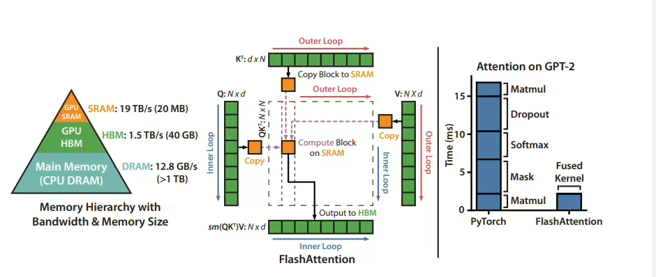

## 1.摘要

1. 通过IO感知，**tiling**技术减少GPU和片上SRAM之间的读写。
2. 扩展了块稀疏注意力
   - 将KV矩阵分块去关注，算法本身并不需要关注所有的KV矩阵

## 2.Introduction

简单来说就是从HBM加载数据到SRAM上计算，然后写会，emmmm，感觉啥好说的，我写核函数的时候都能想到这点。

### 2.1 Challenge：

- 增量的完成softmax的计算:(tiling分块计算)
- 保持softmax的归一化因子。

## 3.标准注意力的HBM访问计算

假设：`N`为序列长度，`d`为注意力头维度，`M` 为GPU片上存储

- 注意力分数矩阵：从HBM中加载`Q(N * d)`和`K(N * d)`，将计算出的`S (N*N)` 写入 HBM
- 注意力权重矩阵：从 HBM中加载`S (N*N)` 将计算出的`P(N*N)` 写入HBM
- 注意力输出：从HBM中加载 `P(N*N)` 和`V(N*d)` 然后将计算的输出`(N*d)`写入`HBM` 

(在训练过程中，不像解码过程的decode阶段，通常要学习全序列的token，而不是基于历史token生成下一个token)

## 4.FlashAttention

### 4.1输入输出

$$
input：K,Q,V∈R^{N×d} \\
output:O∈R^{N×d}
$$

### 4.2softmax稳定优化公式：

$$
\begin{aligned}
m(\boldsymbol{x}) &:=\max_{i \in \{1,2,\dots,B\}} x_i, \quad \text{（输入向量的最大值）} \\
f(\boldsymbol{x}) &:=\begin{bmatrix} e^{x_1 - m(\boldsymbol{x})} & e^{x_2 - m(\boldsymbol{x})} & \dots & e^{x_B - m(\boldsymbol{x})} \end{bmatrix}, \quad \text{（平移后的指数项）} \\
\ell(\boldsymbol{x}) &:=\sum_{i=1}^B f(\boldsymbol{x})_i, \quad \text{（指数项求和，用于归一化）} \\
\text{softmax}(\boldsymbol{x}) &:=\frac{f(\boldsymbol{x})}{\ell(\boldsymbol{x})} = \begin{bmatrix} \frac{e^{x_1 - m(\boldsymbol{x})}}{\ell(\boldsymbol{x})} & \frac{e^{x_2 - m(\boldsymbol{x})}}{\ell(\boldsymbol{x})} & \dots & \frac{e^{x_B - m(\boldsymbol{x})}}{\ell(\boldsymbol{x})} \end{bmatrix}
\end{aligned}
$$

- 如果该计算式分块的，我们则需要将每个块的指数加起来求和用于归一化，同时，我们也要找到两个块的最大值

### 4.3计算过程

1. 前置计算

$$
矩阵\ \ Q,K,V∈R^{N×d}\ 在\ HBM中,片上存储SRAM的大小为M \\
分块:\ \ \  B_c = \frac{M}{4d} \ \  B_r = \min\left( \frac{M}{4d}, d \right)
$$

2. 计算中间量内存分配

$$
\text{Initialize } O = (0)_{N \times d} \in \mathbb{R}^{N \times d}, \ \ell = (0)_N \in \mathbb{R}^N, \ m = (-\infty)_N \in \mathbb{R}^N \ \text{in HBM}.
$$

- 分别是我们attention的输出，每个序列的指数求和值，m则记录行最大值

3. 划分

​	在token的维度上划分，`Br` 为每块大小，将我们的`K V` 划分成`Tc` 块，`Q O ℓ m` 划分成了`Tr`块

4. 内循环：分块计算+重计算

本质：想要分块的完成`softmax` 的过程就必须涉及到重计算

**数据加载**
$$
Q_i,\ O_i,\ \ell_i,\ m_i \leftarrow \text{从HBM加载至片上SRAM}
$$
**计算分块注意力分数矩阵**
$$
S_{ij} = Q_i K_j^T \in \mathbb{R}^{B_r \times B_c}
$$
**计算分块行最大值**
$$
\tilde{m}_{ij} = \text{rowmax}(S_{ij}) \in \mathbb{R}^{B_r}
$$
**计算逐元素指数**
$$
\tilde{P}_{ij} = \exp\left(S_{ij} - \tilde{m}_{ij}\right) \in \mathbb{R}^{B_r \times B_c}
$$
**计算分块行和**
$$
\tilde{\ell}_{ij} = \text{rowsum}(\tilde{P}_{ij}) \in \mathbb{R}^{B_r}
$$
**更新全局最大值**
$$
m_i^{\text{new}} = \max\left(m_i, \tilde{m}_{ij}\right) \in \mathbb{R}^{B_r}
$$
**更新全局归一化分母**
$$
\ell_i^{\text{new}} = e^{m_i - m_i^{\text{new}}} \cdot \ell_i + e^{\tilde{m}_{ij} - m_i^{\text{new}}} \cdot \tilde{\ell}_{ij} \in \mathbb{R}^{B_r}
$$
**更新输出分块，全局最大值，写回HBM**
$$
O_i \leftarrow \text{diag}(\ell_i^{\text{new}})^{-1} \cdot \left( \text{diag}(\ell_i) \cdot e^{m_i - m_i^{\text{new}}} \cdot O_i + e^{\tilde{m}_{ij} - m_i^{\text{new}}} \cdot \tilde{P}_{ij} V_j \right) \quad (\text{写回HBM})\\
\ell_i \leftarrow \ell_i^{\text{new}} \quad (\text{写回HBM})\\
m_i \leftarrow m_i^{\text{new}} \quad (\text{写回HBM})
$$

5. 总结

- 核心价值让我们认识到了如何分块去计算softmax（这也为pageAttention提供了理论基础）
- 教会了我们如何用更小的维度，去冲计算softmax以降低内存的存读取

## 5.扩展：块稀疏 Flash 注意力

我们知道 K V Q都是分块的，这就让我们可以进行判断，最后的dim 的输出是累加的，所以我们可以对一些零矩阵进行过滤。
