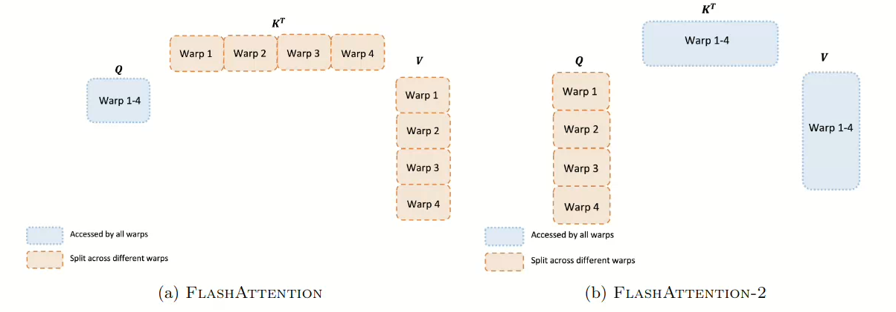

## 1.flashAttention_v1存在的问题

flashAttention_v1：最佳的优势是实现了内存节省，从平方级别到线性级别，但是浮点数的计算效率较低，产生的原因：

- 线程块和线程束分配不合理，进而导致设备占用率过低。
- 不必要的共享内存读写操作也是原因之一。

flashAttention_v2的优化思路：

- 减少非矩阵乘法的运算占比，GPU配置了专门用于矩阵乘法的运算单元。、
- 在序列长度的维度进行并行化处理。
- 重新设计线程束的工作方式，减少共享内存的读写，减少不必要的内存开销。

## 2.flashAttention_v2核心思路：

在更新**更新输出分块，全局最大值，写回HBM** 这一步的时候，我们无需中间的attention进行分母计算，直接将分母的除法放到最后统一进行。
flashAttention_v2之中：
$$
O_i^{(j)} = \text{diag}\left(e^{m_i^{(j-1)} - m_i^{(j)}}\right)^{-1} O_i^{(j-1)} + \tilde{P}_i^{(j)} V_j
$$
在内循环结束之后，我们再统一除以分母进行计算：
$$
O_i = \text{diag}\left(\ell_i^{(T_c)}\right)^{-1} O_i^{(T_c)}
$$
flashAttention_v1之中：
$$
O_i \leftarrow \text{diag}(\ell_i^{\text{new}})^{-1} \cdot \left( \text{diag}(\ell_i) \cdot e^{m_i - m_i^{\text{new}}} \cdot O_i + e^{\tilde{m}_{ij} - m_i^{\text{new}}} \cdot \tilde{P}_{ij} V_j \right) \quad (\text{写回HBM})\\
$$

### 2.1 如何分配cuda块

从flashAttention_v2的特性，我们也不难看出，我们应该将一个外循环的维度设置成block，有多少个Q分组 ->对应多少个维度。这其实就是flashAttention的核心优化，**对长序列进行并行化**。

块大小的依据：块太大了寄存器不够，块小了共享内存不够

- 这里真心不建议拆分K 和 V ，如果拆分了，K本质上最后要进行归约操作，最后会频繁的读取共享内存。
- 而我们的v矩阵，实际上是在dim上进行一个累加的操作，同样不适合拆分！

## 3.关于flashAttention_v2的总结

主要的优化在两个有价值的地方:

- cudablock如何去组织（在外循环的维度上组织）
- 如何减少计算量（Oi 中间变量只记录分子，分母最后一个除法）

