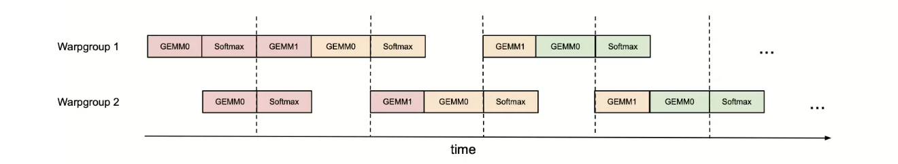
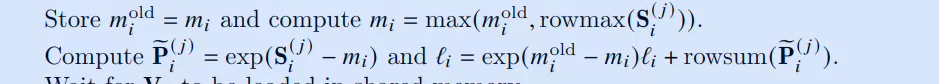
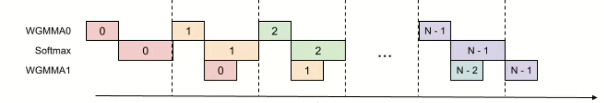
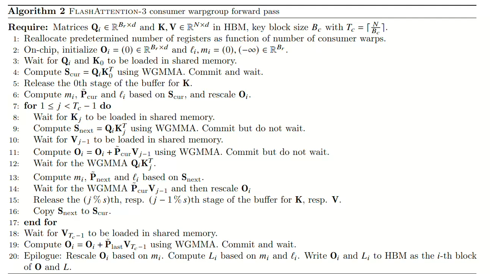
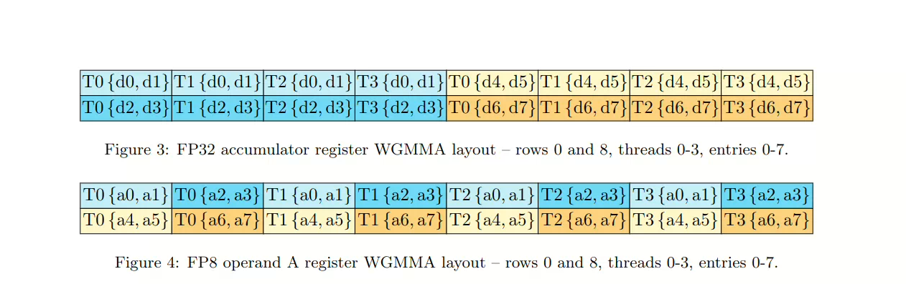

## 1.背景-硬件新特性

### 1.1异步Tensor Cores

Tensor Cores 是GPU专门用于加速矩阵乘法（GEMM）的硬件单元，Hopper架构将其升级为**异步执行模式**：

- 前代的Tensor Cores执行矩阵乘法的时候，会"阻塞"后续指令，需要等待当前运算完成才能继续
- Hopper 的 Tensor Cores 支持 **WGMMA（Warpgroup Matrix Multiply-Accumulate）指令**，运算发起后无需等待结果返回，GPU可以同时调度其他任务。
  - 从底层理解就是warp执行完成之后会继续往下，不会等待线程完成继续。

### 1.2张量内存加速器

- 前代GPU需移开线程手动加载内存，过程线程会因为等待数据而闲置。
- 但是TMA可独立计算线程，异步完成““全局内存->共享内存”的数据块加载 / 存储，并且支持灵活的分块布局。

### 1.3低精度FP8硬件加速

## 2.背景-lashAttention2的表现

- FlashAttention-2 在新一代的GPU上利用率仍比较低
- 未采取Hopper架构的专属指令

### 2.1动机：在flashAttention_2 上明确异步执行和低精度特性

### 2.2创新改进：

1. **Producer-Consumer（生产者 - 消费者）**
   - 生产者负责将数据从HBM搬运到SMEM
   - 消费者负责进行矩阵运算
2. 在异步分块矩阵乘法下隐藏Softmax运算
   - 将softmax中吞吐量相对较低非 GEMM的操作与用于GEMM异步的 WGMMA指令进行并行执行，同时进行调度，规避Softmax 与 GEMM之间特定顺序的依赖关系
3. 硬件加速的低精度矩阵乘法

## 3.补充回顾-GPU的缓存结构

- 全局内存(HBM)：可以被所有的SM访问，属于片外存储，全局内存中的数据会被透明的缓存到L2。
- 二级缓存(L2)：位于芯片内部，作为全局内存与高速缓存之间的中间层。
- 共享内存：每一个SM特留的存储，表现为一个block内部共享。
- 寄存器：一个warp内部的寄存机可以互换数据。

### 3.1线程束组：线程束的“协作单元”负责适配异步张量矩阵乘法运算

Hopper架构的Tensor Core需要专门的`WGMMA`指令调用，而该指令集专门针对WarpGroup，即4个连续的warp，当一个Warpgroup通过`WGMMA` 发起矩阵乘法的时候，无需等待计算完成，就可以释放资源让该`Warpgroup` 执行其余的操作。 

### 3.2Hopper架构新特性

- Hopper架构支持通过`setmaxnreg` 指令在线程束组之间动态重新分配寄存器，因此执行MMA的线程束比仅能发起张量内存的加速器操作的线程束获得更多的寄存器内存
- 发起张量内存加速器仅仅只需要单个线程
- 同时WGMMA对低精度的矩阵乘法运算有更好的支持度

## 4.flashAttenthon_v3

falshAttention_v3 在 flashAttention_v2基础上的改进：

- 将线程专业化与循环共享内存缓冲区整合到了FlashAttention-2之中。
- 利用WGMMA的异步特性，设计出GEMM和sotemax重叠执行的两阶段流水线。
- FP8 精度下算法的修改与内存兼容。

### 4.1 基于线程束专业化与乒乓调度的生产者 - 消费者异步机制

### 结合循环共享内存缓冲区（circular SMEM buffer）的线程束专业化方案:(without intra-consumer overlapping – CTA view)

1. 初始化流水线对象，该对象通过s阶段循环共享内存缓冲区管理屏障同步（一般是生产者和消费者一一对应）
2. 生产者线程组
   - 释放预设数量的寄存器
   - 将Qi矩阵拷贝到共享内存之中
   - 加载完成之后，告知消费者矩阵Qi已经加载
   - 循环加载矩阵 K V，加载到共享内存缓冲区（j%s）
     - 加载完成之后告知消费者已经被加载
3. 消费者线程：
   - 过程同我们的flashAttention_v2总结
   - 但是每次访问我们的存储单元的时候都需要commit一下流水线对象。
   - 同时访问结束后即使的释放缓冲区的存储空间
   - 最后，执行矩阵的惩罚的时候，调用我们的WGMMA指令集进行计算

**总结**：大体上生产者线程和消费者线程一对一的关系（线程数量需要进行二分配），生产者线程基本上和flashAttention_v2的计算过程差不多，只不过每一次访问的时候都需要提交到流水线对象查看缓存是否加载完成

### 4.2乒乓调度

- 相同的颜色代表了相同的迭代轮次
- 为什么softmax可GEMM可以重叠（**低吞吐量硬件瓶颈型操作**和**高吞吐量硬件友好型操作** ）
- 所以在一个SM上，完全调度的过来两个warpGroup的不同阶段的计算

**重点：**因为WGMMA的支持，所以我们可以在同一个warpGroup内完成整个乒乓调度的全过程。

### 4.3 在同一个warpGroup中实现乒乓调度的困境

softmax中的mi的计算结果依赖于GEMM0中的矩阵中的运算结构，寻求最大值mi，更新最新的分母求和

同时Pi的计算也会影响到GEMM0中分子的求和计算

解决办法：跨迭代执行，在同一个迭代中必须保持数据的流水线，但是不同数据块就没有这个要求，我们可以将下一步的数据块提前引入进行

让上一个数据块的 WGMMA1 与 本数据块的softmax 同步执行。

### 4.4 重新构造消费者线程块的运算（一次迭代三步流水线，两个重叠）：

- 首先的变动是我们在内循环开始前和内循环结束后，都要起个头或者扫个尾巴
- 然后在内循环中，我们注意运用到了WGMMA的指令集合 “Commit but do not wait”
- 再计算当前的softmax阶段的时候，我们先提交上一次的WGMMA1矩阵，并且与当前的softmax的过程同步
- 这个IDEA确实奇妙

### 4.5 存在的问题：

- 寄存器压力：存储了S next 增加了额外的寄存器开销
- 编译器优化打乱布局

## 5.对FP8精度的支持

**问题的本质**：FP8的数据存储小，所以合并内存事物的访问对原始结果的优化更加明显
**解决思路**：在全局内存中对矩阵V进行转置或者在共享内存中对矩阵进行转置

flashAttention_v3 在这里选择了方案2，加载到核函数中再进行转置（生产者进行转置操作！）

**LDSM** 和 **STSM** 指令均具备寄存器高效性：一方面，它们允许我们在生产者 warp 组（producer warpgroup）中执行转置操作；另一方面，在进行内存复制时，这两种指令还能够直接实现布局转置。

### 5.1其他优化

- 分组张量缩放； 块 + 缩放因子存储。
- 异常值的分散 ，Q 和 K 都乘以一个随机的正交矩阵。
