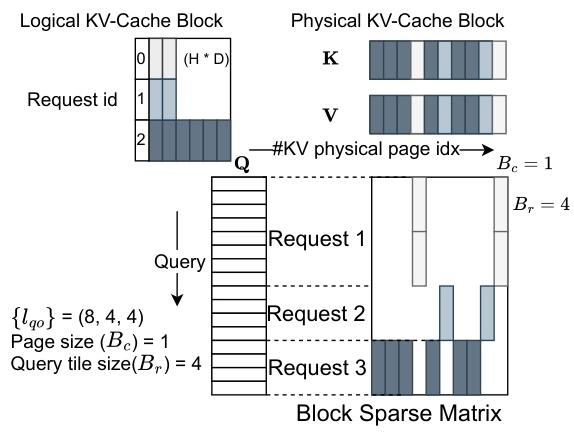
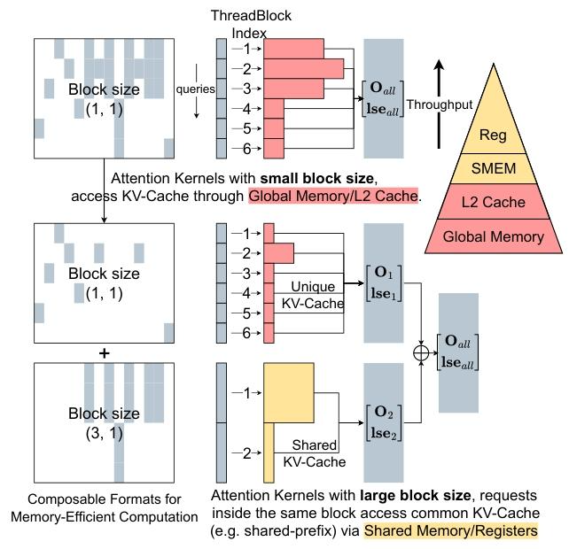
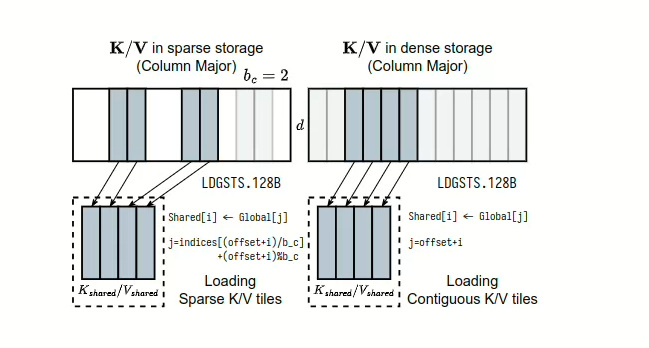
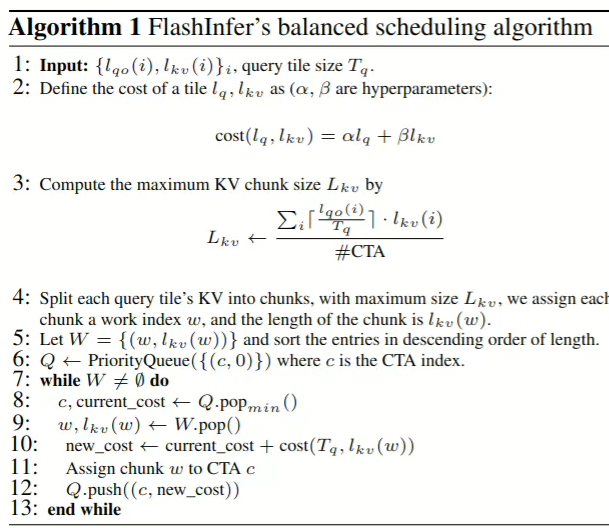
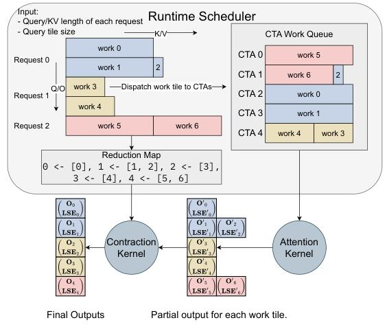

## 1.flashInfer

### 1.1KV缓存的异构性

- 不同batch的KV缓存长度不同，内存连续分配的效率低
- 存储格式多样化
- 访问频率不同
- 对不同软件和硬件的优化的限制

### 1.2 point

- 通过块稀疏格式和可组合格式处理KV缓存存储的异构性，优化内存访问，减少冗余
- 通过即时的编译（在运行的时候根据输入和环境编译出优化后的机器代码）适配各种场景

### 1.3 challenge

- （前缀重用，prefill和decode，查询长度的不同）容易出现负载不平衡的问题，调度算法需要让底层的注意力计算内核能够动态自适应。

### 1.4 design

- 块稀疏格式来应对KV缓存存储的异构性。
- 可编程结构->可定制的注意力模板。
- 兼容CUDAGraph
- 动态负载均衡调度框架，应对输入的动态变化。


 首先，从这张图中我们可以总结出，JIT运行时编译主要关注：

- 注意力变体格式
- 任务信息
- KV缓存的布局格式信息


## 2.BPT中状态缩放指令的引入

### 2.1注意力缩放因子：

$$
LSE(\mathcal{I})=\log \sum_{i \in \mathcal{I}} \exp \left(q \cdot k_{i}\right)
$$

- 这里的`i` 实际上对应了`K V` 矩阵的分块，注意这里是**点积**
- LSE(I) 就是 softmax 的“分母部分”在 block 内独立求和后的 log

### 2.2注意力的输出：

$$
O(\mathcal{I}) = \sum_{i \in \mathcal{I}} \frac{\exp(q \cdot k_{i})}{\exp(LSE(\mathcal{I}))} \cdot v_{i} \quad (2)
$$

- 注意，在我们的论文中,`log` 和我们的ln是等价的
- O[I]是标量，拥有完整的当前块的attention方向，但是scale不同


### 2.3将注意力输出和缩放因子打包成状态，便于在不同状态之间组合归纳

$$
[\begin{array}{c}O(\mathcal{I}) \quad LSE(\mathcal{I})\end{array}]
$$

$$
\begin{aligned} {\left[\begin{array}{c} O(\mathcal{I} \cup \mathcal{J}) \\ LSE(\mathcal{I} \cup \mathcal{J}) \end{array}\right] } & =\left[\begin{array}{c} O(\mathcal{I}) \\ L S E(\mathcal{I}) \end{array}\right] \oplus \left[\begin{array}{c} O(\mathcal{J}) \\ L S E(\mathcal{J}) \end{array}\right] \\ & =\left[\begin{array}{c} \frac{exp (L S E(\mathcal{I})) O(\mathcal{I})+exp (LSE(\mathcal{J})) O(\mathcal{J})}{exp (LSE(\mathcal{I}))+exp (LSE(\mathcal{J}))} \\ log (exp (L S E(\mathcal{I}))+exp (L S E(\mathcal{J}))) \end{array} \right] \end{aligned}
$$


### 2.4总结

- 其实和flashAttention中的计算思想是一致的
- 只不过flashAttention_v1更复杂在使用的是softmax的稳定版
- 思路和flashAttention没区别，分块求和重计算


## 3. 块压缩稀疏行（Block Compressed Sparse Row，BSR）

```c++
//大小等于行块数目+1，表示 第 i 行之前有多少个元素
row_ptr = [0, 2, 5, 7]
//记录每个非零索引对应的列ID
col_ind = [0, 3, 1, 2, 4, 1, 3]
//data
data
```


## 4.flashInfer

### 4.1pageAttention怎么去存储BSR



- 实则这里pageTable 等价于 BSR的列索引
- 这里稀疏矩阵的一行的大小就是整个物理矩阵的维度

### 4.2为什么flashInfer要做这种模式的等价？

- 统一KV Cache的存储结构，底层默认采用BSR的存储方式
- 这样kernei只需要按照BSR的方式去计算KV Cache即可

### 4.3flashInfer 对input和output的存储：ragged tensors

- 就是一个不规则的张量，没什么好说的，不需要填充。
- 本质上是因为query的请求长度不同导致的。还有output的`token by token` 生成的长度也不一致。
- 目的是让来自不同请求的query和output紧凑地打包在同一个张量之中。

### 4.4pageAttention特色：block越大（这里指的应该是query的长度），可共享的KVCache越多



- 越多的query，我们越能在KV Cache的前缀和中共享我们的内存
- 复用的话，我们直接指向同一块索引就可以了

### 4.5面向内存效率的可组合格式

- 这里我的理解就是不懂稀疏矩阵数据本身，而是修改block的大小，影响到每次加载多少数据区计算attention。
- 还是如上图，我们可以利用不同细粒度的KV组合计算，然后按照`BPT` 中的sotemax分块计算，最后结果组合即可得到最终的结果

**总结**：整个计算不是单个的blockSize，而是多个blockSIze的混合，最大化提高内存利用效率。

### 4.6全局内存到共享内存的迁移

- FlashInfer 注意力模板支持任意块的大小，由于块的大小可能和张量核心（Tensor Core）不匹配，所以需要专门的数据加载方案。

  

- 无论在稀疏矩阵中KV-Cache是连续还是稠密的
- flashInfer都要在共享内存之中加载成紧密的


## 5.FlashInfer 如何用 JIT 编译器自动生成各种 Attention 内核

目的：把不同的注意力变体（softmax / sigmoid / sparse / dense / custom logits transform）用一个模板框架，以 JIT 方式生成完整 CUDA kernel。

### 5.1什么是JIT

在程序运行时生成 CUDA C++ 代码 → 编译成 PTX → 加载到 GPU → 立刻运行。
PTX是cuda编译的中间语言


### 5.2 python端定义注意力规格

```python
spec_decl = r"""
template <typename Params_, typename KernelTraits_>
struct FlashSigmoid {
    using Params = typename Params_;
    using KernelTraits = typename KernelTraits_;

    static constexpr bool use_softmax = false;
    float scale, bias;

    FlashSigmoid(const Params& params, int batch_idx, uint8_t* smem_ptr) {
        // Copy from CUDA constant memory to registers
        scale = params.scale;
        bias = params.bias;
    }

    float LogitsTransform(const Params& params,
                          float logit_score,
                          int batch_idx,
                          int qo_idx,
                          int kv_idx,
                          int qo_head_idx,
                          int kv_head_idx) {
        return 1.0f / (1.0f + expf(-(logit_score * scale + bias)));
    }
};
"""

attn_spec = AttentionSpec(
    "FlashSigmoid",
    dtype_q, dtype_kv, dtype_o, idtype,
    head_dim, is_sparse,
    additional_vars=[("scale", "float"), ("bias", "float")],
    additional_tensors=[],
    spec_decl=spec_decl
)

```

- LogitsTansform()是用户可以自定义的部分，用来替换softmax的处理
- 提供一段CUDA C++ 模板代码，用于JIT的生成
- CUDA Kernel的输入结构体


### 5.3内核参数类，由flashInfer自己生成

```c++
template <typename DTypeQ, typename DTypeKV, typename DTypeO, typename IdType>
struct Params {
    DTypeQ* q;
    DTypeKV *k, *v;
    DTypeO* o;
    float* lse;
    IdType* qo_indptr;
    IdType* kv_indptr;
    IdType* kv_indices;
    IdType* kv_seq_lens;
};

```


### 5.4 注意力内核的主题

```c++
template <typename AttentionSpec>
__global__ void KernelTemplate(AttentionSpec::Params params) {

    AttentionSpec attn(params, batch_idx, smem_ptr);

    // Iterate over logits tile
    for (int i = 0; i < size(logits_tile); ++i) {

        // 将线程索引转换为注意力坐标 (qo_idx, kv_idx)
        qo_idx = get<0>(logits_tile(i));
        kv_idx = get<1>(logits_tile(i));

        // 调用自定义 logits 转换函数（可替换 softmax）
        logits_tile(i) = attn.LogitsTransform(
            params,
            logits_tile(i),
            batch_idx,
            qo_idx,
            kv_idx,
            qo_head_idx,
            kv_head_idx
        );
    }

    ...
}

```

在每个tile的循环里面调用

```
attn.LogitsTransform(...)
```


### 5.5注册Pytorch运算符

```c++
TORCH_LIBRARY_IMPL("FlashSigmoid", CUDA, m)
```

相当于在python中调用:

```python
flashinfer.flash_sigmoid(q, k, v, scale, bias)
```

FlashInfer自动：

- 调用JIT编译CUDA Kernel
- 选择合适的tile
- 调度稀疏/密集访问
- 执行注意力计算
- 返回结果tensor


### 5.6 内部结果定制化，中间结果多层Transformer

**QueryTransform**：在注意力计算前对Query做变换
**KeyTransform**：对key
**ValueTransform**：对value做变换
**OutputTransform**：对注意力的输出做变换
**LogitsTransform**：softmax 之前对 logits（q⋅k）做修改
**LogitsMask**：对 logits 做 mask


## 6.动态感知的运行时

### 6.1负载均衡



- 将工作动态均分到所有流多处理器之中

### 6.2 FlashInfer 的负载均衡调度算法

**输入：**  
- $$
  \{\, l_{\text{qo}}(i),\; l_{\text{kv}}(i) \,\}
  $$

- $$
  Query \ \ tile 大小 T_q \ \ 代表了一次在tensor\ Core中并行处理多少数据
  $$

---

### 第 1 步：定义代价函数（cost function）

对一个 tile 定义代价：

$$
\text{cost}(l_q,\, l_{kv}) = \alpha \, l_q + \beta \, l_{kv}
$$

其中 alpha, beta为超参数。

---

### 第 2 步：计算最大 KV 分块大小

对每个 tile_i，计算：

$$
L_{kv} \leftarrow 
\max_i 
\left\lceil 
\frac{T_q}{l_{\text{qo}}(i)} 
\right\rceil \cdot l_{\text{kv}}(i)
$$

---

### 第 3 步：将每个 query tile 的 KV 划分为多个 chunk

每个 query tile 的 KV 划分为长度不超过 $L_{kv}$ 的 chunk。

为每个 chunk 分配一个工作索引 $w$，其长度为 $l_{kv}(w)$。

构建集合：

$$
W = \{\, (w,\; l_{kv}(w)) \,\}
$$

并按 $l_{kv}(w)$ **降序排序**。

---

### 第 4 步：初始化 CTA（线程块）优先队列

初始化一个最小堆优先队列：

$$
Q \leftarrow \text{PriorityQueue}\big( \{ (c,\; 0) \} \big)
$$

其中每项为 `(CTA 编号 c, 当前代价 current_cost)`。

---

### 第 5 步：将 chunk 依次分配给 CTA（负载均衡）

当 $W \neq \varnothing$ 时，重复：

1. 取出当前代价最小的 CTA：
   $$
   (c,\; \text{current\_cost}) = Q.\text{popmin()}
   $$

2. 从 $W$ 中取出剩余 chunk 中最长的一个：
   $$
   (w,\; l_{kv}(w)) = W.\text{pop()}
   $$

3. 计算新的代价：
   $$
   \text{new\_cost} = \text{current\_cost} + \text{cost}(T_q,\, l_{kv}(w))
   $$

4. 将 chunk $w$ 分配给 CTA $c$

5. 将更新后的代价重新放回队列：
   $$
   Q.\text{push}\big( (c,\; \text{new\_cost}) \big)
   $$

**总结：**这里就是给每个队列一个代价，然后将当前分成的块放入代价最小的之中。




- 从图中可以看出细节，分为Contraction Kernel 和 Attention Kernel （专门计算注意力的内核和注意力合并的内核）
- CTA在这里的含义我们可以看成线程块
- 块的大小不固定，但是最大块的大小要固定
- 保留reduction Map,最后合并的时候需要！
- 简单的理解成按照CTA的数量分块
- 取出一个代价最小的CTA,最大的块，然后将大块放入，记录Map
- 最后按照map进行合并


## 7.flashInfer的编程接口

```python
# 创建工作区缓冲区（workspace），用于存储部分输出和计划信息
workspace = torch.empty(...)
# 初始化序列长度信息（seqlen_info），为动态调度准备
seqlen_info.init()
# 编译：为每个任务信息创建 CUDAGraphs
graphs = []
for task_info in task_infos:
    # 初始化：根据注意力变体规范（attn_spec）和任务信息（task_info）编译内核
    attn = AttentionWrapper(attn_spec, task_info, workspace)
    # 创建 CUDAGraph 对象，准备捕获 CUDA 图
    g = torch.cuda.CUDAGraph()  # 空的计划图（Dummy plan）
    # 计划：生成调度计划并传递给 CUDAGraph
    attn.plan(seqlen_info) 
    # 捕获 CUDA 图
    with torch.cuda.graph(g):
        for i, layer in enumerate(layers):
            # 这里可以添加对每个层的计算
            ...
            # 运行注意力计算
            attn.run(...)
    # 将捕获的 CUDAGraph 添加到图列表中
    graphs.append(g)
# 运行时：根据当前情况选择最合适的 CUDAGraph
g = select_graph(graphs)
finished = False
# 文本生成循环，直到生成完成
while not finished:
    # 更新序列长度信息（seqlen_info）
    seqlen_info.update()
    # 计划：为每个生成步骤重新规划，并准备播放 CUDAGraph
    attn.plan(seqlen_info)
    # 播放之前捕获的 CUDAGraph
    g.replay()
```

- 一个任务一个cudaGraph
- 根据人物信息变异内核，然后捕获CUDA图
- 根据当前的请款相关则合适的CUDAGraph
- 最后进行文本生成循环，直到生成完成。


## 8.总结：

- flashInfer给我的经验主要在调度。
- 然后提供了一套编程框架思路上，然而最关键的核心还是flashAttention的分块思想！
- 调度策略与分块矩阵组合的思想可以结合。
- 最后统一了稀疏矩阵的输入方式。
