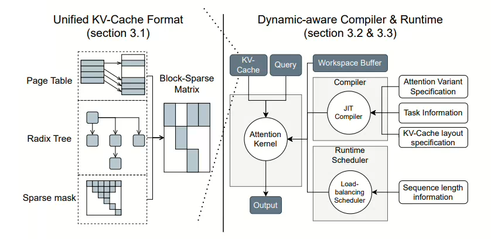

## 1.flashInfer

### 1.1KV缓存的异构性

- 不同batch的KV缓存长度不同，内存连续分配的效率低
- 存储格式多样化
- 访问频率不同
- 对不同软件和硬件的优化的限制

### 1.2 point

- 通过块稀疏格式和可组合格式处理KV缓存存储的异构性，优化内存访问，减少冗余
- 通过即时的编译（在运行的时候根据输入和环境编译出优化后的机器代码）适配各种场景

### 1.3 challenge

- （前缀重用，prefill和decode，查询长度的不同）容易出现负载不平衡的问题，调度算法需要让底层的注意力计算内核能够动态自适应。

### 1.4 design

- 块稀疏格式来应对KV缓存存储的异构性。
- 可编程结构->可定制的注意力模板。
- 兼容CUDAGraph
- 动态负载均衡调度框架，应对输入的动态变化。

 首先，从这张图中我们可以总结出，JIT运行时编译主要关注：

- 注意力变体格式
- 任务信息
- KV缓存的布局格式信息

## 2.BPT中状态缩放指令的引入

### 2.1注意力缩放因子：

$$
LSE(\mathcal{I})=\log \sum_{i \in \mathcal{I}} \exp \left(q \cdot k_{i}\right)
$$

- 这里的`i` 实际上对应了`K V` 矩阵的分块，注意这里是**点积**
- LSE(I) 就是 softmax 的“分母部分”在 block 内独立求和后的 log

### 2.2注意力的输出：

$$
O(\mathcal{I}) = \sum_{i \in \mathcal{I}} \frac{\exp(q \cdot k_{i})}{\exp(LSE(\mathcal{I}))} \cdot v_{i} \quad (2)
$$

- 注意，在我们的论文中,`log` 和我们的ln是等价的
- O[I]是标量，拥有完整的当前块的attention方向，但是scale不同

### 2.3将注意力输出和缩放因子打包成状态，便于在不同状态之间组合归纳

$$
[\begin{array}{c}O(\mathcal{I}) \quad LSE(\mathcal{I})\end{array}]
$$

$$
\begin{aligned} {\left[\begin{array}{c} O(\mathcal{I} \cup \mathcal{J}) \\ LSE(\mathcal{I} \cup \mathcal{J}) \end{array}\right] } & =\left[\begin{array}{c} O(\mathcal{I}) \\ L S E(\mathcal{I}) \end{array}\right] \oplus \left[\begin{array}{c} O(\mathcal{J}) \\ L S E(\mathcal{J}) \end{array}\right] \\ & =\left[\begin{array}{c} \frac{exp (L S E(\mathcal{I})) O(\mathcal{I})+exp (LSE(\mathcal{J})) O(\mathcal{J})}{exp (LSE(\mathcal{I}))+exp (LSE(\mathcal{J}))} \\ log (exp (L S E(\mathcal{I}))+exp (L S E(\mathcal{J}))) \end{array} \right] \end{aligned}
$$

### 2.4总结

- 其实和flashAttention中的计算思想是一致的
- 只不过flashAttention_v1更复杂在使用的是softmax的稳定版
- 思路和flashAttention没区别，分块求和重计算

## 3.flashInfer的设计：

