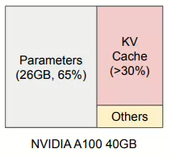
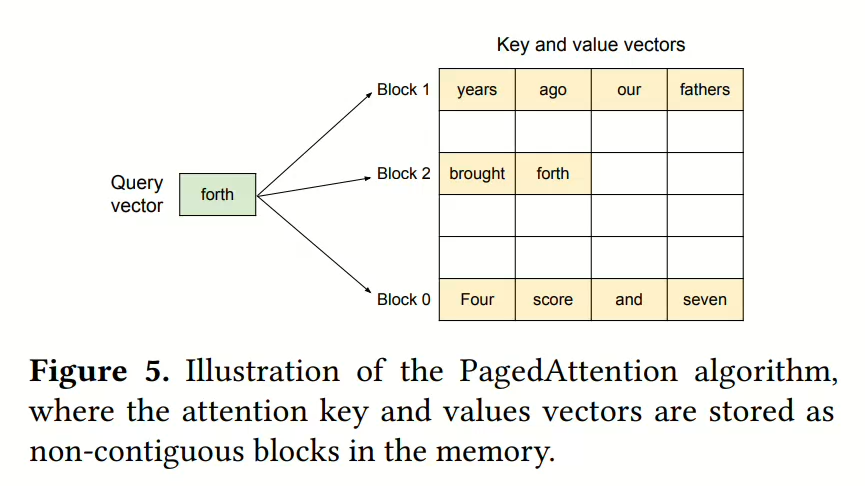
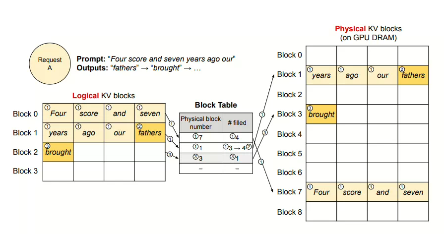
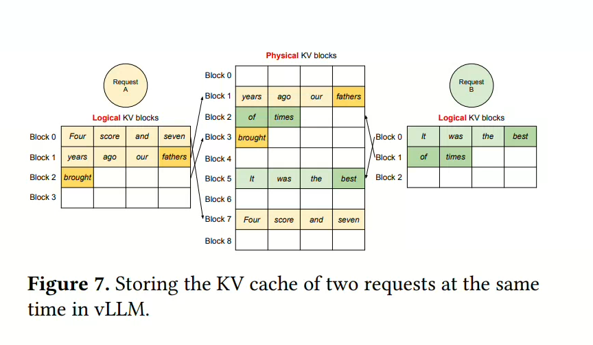
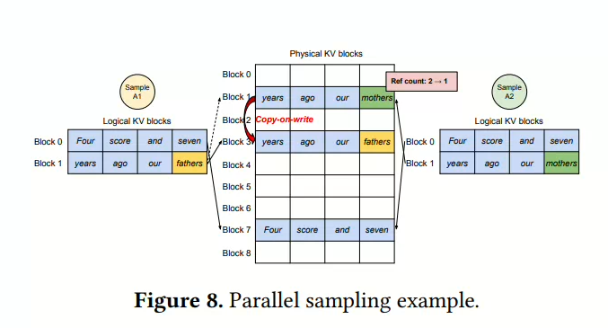
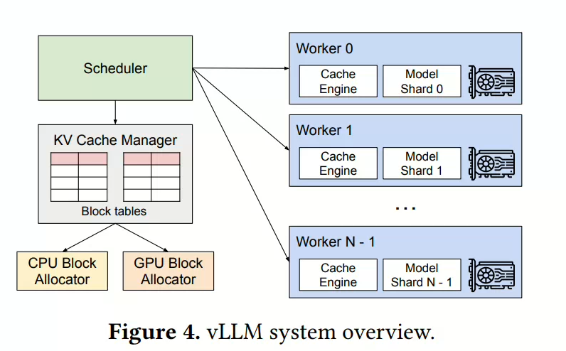

## 1. 背景

LLM的**高吞吐服务**依赖于在同一时间对足够多的请求进行批处理，但是每个请求的KV Cache通常不一样，而且占用内存庞大，会动态收缩和增长。如果内存管理不当就会碎片化和冗余复制而造成大量的内存浪费。

- 现有的系统容易产生内部和外部的内存碎片（通常预分配一块请求的最大可能长度）。
- 通常tensor申请的是连续的内存空间，这样就容易产生外部碎片。
- KV Cache的共享

上图举例代表了运行时GPU显存的比例分配情况（激活值通常用于残差连接，模型参数，KV Cache）

### 1.1 pagedAttention设计的核心思路

- 将每个请求的KV Cache划分为若干快，每个块可以存储固定数量的token和注意力 **Key** 和 **Value**
- 灵活的管理，操作系统的分页
  - 可以将块类比为页
  - token类比为字节
  - 请求类比为进程

基于以上原理，作者构建了vLLM，核心思路是基于pagedAttention的高吞吐分布式LLM服务引擎，采用了会计内存管理和抢占式请求调度。

## 2.attention的分块计算

$$
\begin{equation}
A_{ij} = 
\frac{
    \exp\left( \frac{q_i^\top K_j}{\sqrt{d}} \right)
}{
    \sum_{t=1}^{\lceil i / B \rceil} \exp\left( \frac{q_i^\top K_t}{\sqrt{d}} \right)
}, 
\quad
o_i = \sum_{j=1}^{\lceil i / B \rceil} V_j A_{ij}^\top
\end{equation}
$$
感觉这里要求我们先遍历每个块获得`qi @ Kj`的值，并且进行累加保存，最后回过头来算输出的时候，都会得到一个dim维度的分数，最后进行累加就可以了。

## 3.内存管理器

一个请求的`KV Cache` 被表示为一系列逻辑`KV`块，并且随着新的token机器KV缓存的生成，从左到右依次填充。KV块还礼维护块表，用于记录每个请求的逻辑KV块和物理KV块之间的映射关系。

- 一个上下文共享同一个逻辑 KV Block
- 通过计数来判断块是否被释放

## 4.其他场景中的应用

### 4.1并行采样

- 当引用计数 > 1 的时候，要分配另外一个逻辑块

## 5. 调度与抢占

- 整块驱逐，启发式计算哪一块最不常用
- 驱逐方式：
  - 重新计算
  - 放到CPU

## 

- 单一的KV缓存管理器
  - 模型分层，KV Cache也按model的分层进行区分，每个GPU工作器都有相同的物理ID，每个工作期只存储对应注意力头的一部分KV Cache
  - 调度器首先为批次中的每个请求准备消息，包括输入的token ID以及每个快表（所以无需进行同步）

## 6.总结

- 本章主要结合vllm学习了一下paged attention的原理与多种场景下的用法。
- 这是一种操作系统中的分页内存管理机制，方法是老的，用法是新的。
